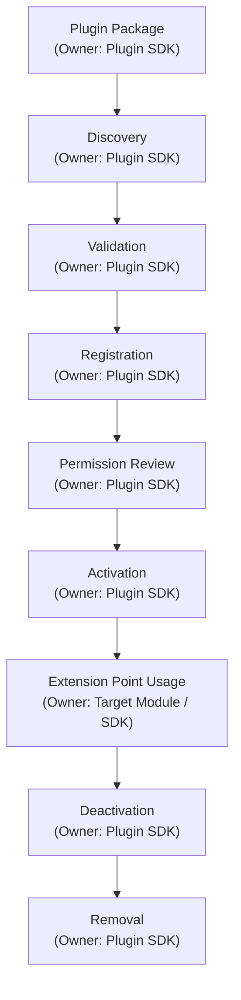

# 03 — Extension Points

> **Module:** Plugins
> **Status:** Approved
> **Applies To:** Notebook Application

---

## 1. Purpose

The Extension Points document defines the specific, stable contracts that Plugins can consume to integrate with the Notebook application without altering core modules.

---

## 2. Extension Philosophy

- **Extension points are stable public contracts.** They shield plugins from internal refactoring.
- **Plugins extend functionality without modifying core modules.** The Domain layer does not know a plugin exists; it only knows an interface is fulfilled.
- **Extension points preserve module boundaries.** A plugin cannot invent a new way to save data; it must use the SDK's exposed methods.

---

## 3. Current and Future Extension Points

### 3.1 Domain & Content Extensions
- **Editor extensions:** Custom block types, syntax highlighting.
- **Visualization providers:** Custom graphs (e.g., Mermaid, Kanban views).

### 3.2 Infrastructure Extensions
- **Import providers:** Markdown, HTML, Roam, Obsidian parsers.
- **Export providers:** PDF, JSON, DOCX generators.
- **Synchronization providers:** WebDAV, S3, Custom Cloud adapters.
- **Backup providers:** Custom off-site backup routers.

### 3.3 Intelligence Extensions
- **AI providers:** OpenAI, Local LLMs (Ollama), custom semantic search models.
- **Search providers:** Custom indexing algorithms.

### 3.4 UI & Workflow Extensions
- **Commands:** Adding actions to the Command Palette.
- **Toolbar extensions:** Custom buttons in the editor.
- **Sidebar extensions:** Custom panels for metadata or navigation.
- **Context menu extensions:** Right-click actions.
- **Workspace actions:** Scripts that automate tagging or formatting.
- **Theme providers:** Custom CSS and color palettes.
- **Automation providers:** Background scripts reacting to events.
- **Future APIs:** As the core application grows, new contracts will be exposed.

---

## 4. Workflow

*Note: Every stage has a single owner. Ownership never transfers. Plugins operate through stable extension points only.*

---

## 5. Business Rules

- **Plugins communicate only through approved extension points.**
- **Extension points remain stable public contracts.**

---

## 6. Acceptance Criteria

- A plugin registering an `ImportProvider` uses the exact same interface signature as the native core Markdown importer.

---

## 7. Cross References

- [01-PluginOverview.md](./01-PluginOverview.md)
