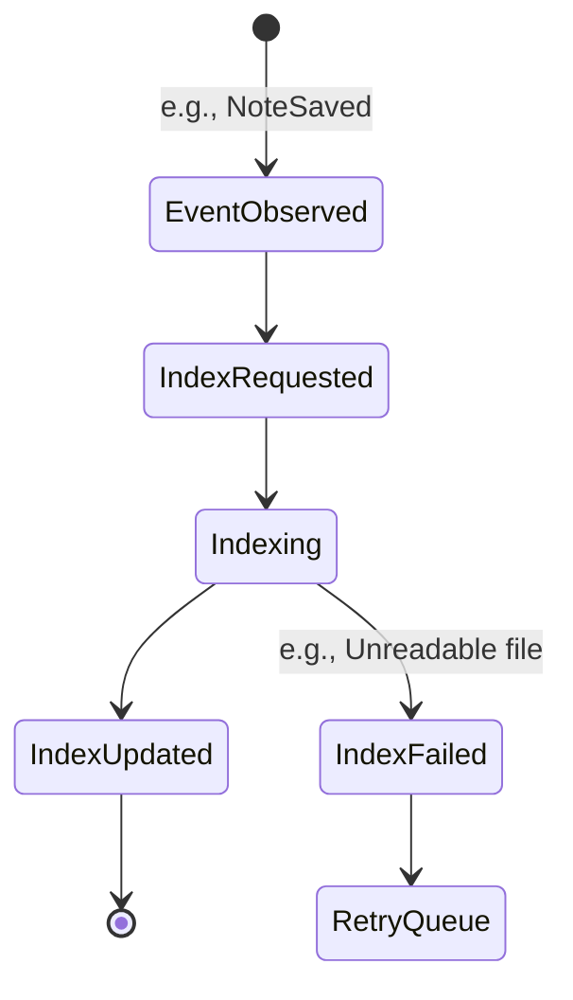
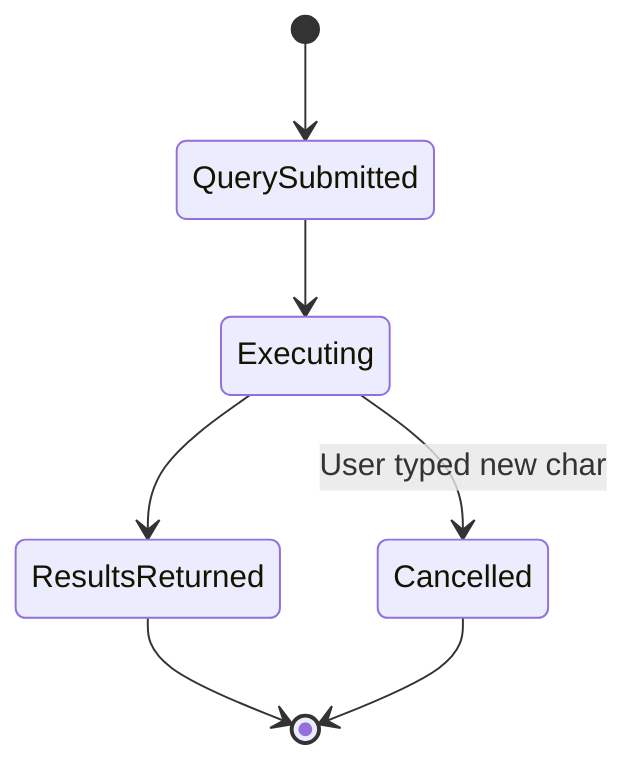

> **Document Type:** Module Specification
> **Status:** Draft
> **Version:** 1.0
> **Depends On:** Search Module
> **Document Owner:** Core Architecture Team

# 02 — Search Lifecycle

---

## 1. Purpose

This document outlines the lifecycles within the Search module. It separates the lifecycle of maintaining the index from the lifecycle of a user's active search query.

## 2. Index Lifecycle Operations

### 2.1 Index Request
- An event (e.g., `NoteSaved`) flags an entity as needing to be indexed. The request is placed in a conceptual queue.

### 2.2 Index Update (Incremental)
- The module processes the queue, extracting the necessary text and metadata from the canonical source and updating the derived search index.

### 2.3 Reindex (Full)
- A system-wide operation that drops all existing indexes and rebuilds them from scratch by traversing every Note, Attachment, and Tag in the Workspace.

## 3. Query Lifecycle Operations

### 3.1 Search Query
- A consumer submits a structured request (e.g., `query="meeting", filters=[tags:"urgent"]`).

### 3.2 Search Results
- The module executes the query against the index and returns a transient list of pointers (UUIDs and metadata) pointing back to the canonical entities.

### 3.3 Refresh
- A UI consumer may request a refresh of the Search Results if it detects that the underlying index was recently updated while the user was viewing the search screen.

### 3.4 Cancellation
- A search query can be aborted mid-execution (e.g., the user types the next character, invalidating the previous query).

## 4. Lifecycle Diagrams

### 4.1 Index Update Workflow

### 4.2 Query Workflow

## 5. Business Rules

- **Eventual Consistency:** The search index is conceptually eventually consistent. A Note saved at `T=0` might not appear in search results until `T=1`.
- **Idempotency:** Reindexing the same Note ten times must result in a single, accurate representation of that Note in the index, not ten duplicates.
- **Graceful Degradation:** If an Index Update fails, the module must not crash the application. It should log the failure and leave the old index entry intact until a retry succeeds.

## 6. Acceptance Criteria

- Saving a Note immediately queues an Index Request, returning control to the user instantly while the Search module updates the index in the background.
- Triggering a "Full Reindex" successfully wipes the search database and reconstructs it over time, without deleting a single canonical Note from the filesystem.
