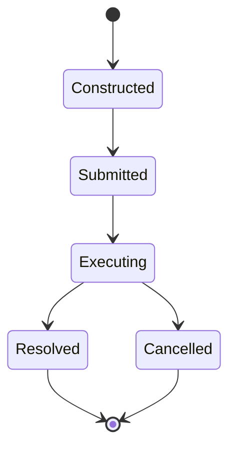

> **Document Type:** Module Specification
> **Status:** Draft
> **Version:** 1.0
> **Depends On:** Search Module
> **Document Owner:** Core Architecture Team

# 04 — Search Queries

---

## 1. Purpose

This document defines the conceptual structure of Search Queries within the Notebook application. It ensures that queries are treated as formalized, immutable requests that safely interrogate the search index without modifying canonical data.

## 2. Query Concepts

### 2.1 Immutable Request Objects
- A Search Query is conceptually an immutable request object (e.g., `Query(term="meeting")`).
- Once a query is constructed and submitted to the Search module, its properties cannot be changed. To refine a search, a brand new Query object is instantiated.

### 2.2 Independence
- Search Queries are entirely independent from the Indexing process. The indexing engine constantly builds data structures in the background, while the query engine acts as a read-only consumer of those structures.

## 3. Query Composition

### 3.1 Simple Search
- A standard full-text query matching substrings or whole words against the indexed payloads of Notes, Tags, and OCR Results.

### 3.2 Advanced Search
- Queries that incorporate boolean logic (AND, OR, NOT), exact phrase matching (`"exact phrase"`), or specific metadata scoping (e.g., `title:meeting`).

## 4. Future Query Enhancements

### 4.1 Saved Searches
- Allowing users to persist a specific Query object in the database, effectively creating dynamic, auto-updating virtual folders based on search criteria.

### 4.2 Search History
- Maintaining a temporary log of recently executed Query objects to allow users to quickly re-run past searches.

### 4.3 Search Suggestions
- Conceptually breaking down a partial query to suggest autocomplete results (e.g., typing "mee" suggests "meeting") based on the current state of the index.

## 5. Query Lifecycle Workflow

## 6. Business Rules

- **Immutable Requests:** Queries are immutable. If the user types another character, the old query is Cancelled and a new query is Constructed.
- **Read-Only:** Queries NEVER modify Notebook data. They only read from the derived search indexes.
- **No Side Effects:** Executing a query must not alter the modification date or access history of the canonical Notes it returns.

## 7. Acceptance Criteria

- Submitting a query for "Tax 2023" returns a list of results without modifying the underlying Notes.
- If the user types "Tax 2024" rapidly, the "Tax 2023" query execution is cleanly cancelled and superseded by the new immutable query.
