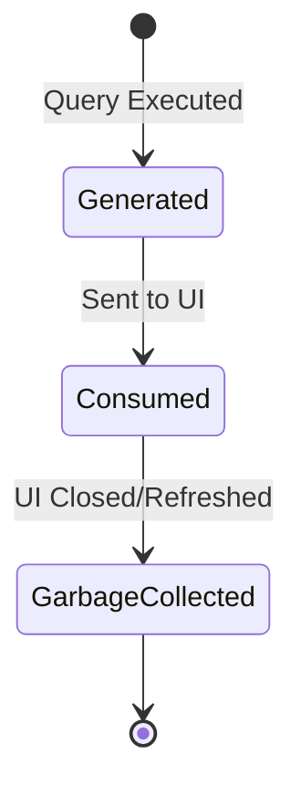

> **Document Type:** Module Specification
> **Status:** Draft
> **Version:** 1.0
> **Depends On:** Search Module
> **Document Owner:** Core Architecture Team

# 07 — Search Results

---

## 1. Purpose

This document defines the conceptual structure of Search Results. It clarifies that results are volatile, derived objects acting as pointers, ensuring they are never conflated with the canonical data they represent.

## 2. Search Result Concepts

### 2.1 Result Identity
- A Search Result does not have a permanent identity. It is an ephemeral, dynamically generated object created in response to a specific Search Query.
- A Result acts as a pointer containing the UUID of the canonical entity (e.g., Note UUID, Attachment UUID).

### 2.2 Derived Nature
- Search Results are entirely derived from the search index at the moment of execution.
- **Rule:** Search Results are derived objects. They NEVER become canonical data.

### 2.3 Search Result Stability
- Running the exact same query multiple times may legitimately produce different result ordering if the underlying indexed content changes between executions.
- Changes to ranking algorithms may also shift result ordering.
- These shifts do not modify canonical Notebook content. Result ordering remains strictly a presentation concern.

## 3. Result Presentation Concepts

### 3.1 Result Grouping
- Conceptually, results may be grouped by entity type (e.g., "Notes" vs "Attachments") or by Folder location, depending on the Discovery UI's request.

### 3.2 Result Highlighting
- The module extracts a small snippet of text surrounding the matched query string (e.g., `...discussed in the <b>meeting</b> today...`) to provide context. This snippet is a transient string and does not modify the canonical Note payload.

### 3.3 Result Metadata
- A Result object bundles relevant metadata to aid UI presentation, such as `Title`, `Last Modified Date`, and associated `Tag UUIDs`, avoiding N+1 database queries to the Notes module.

## 4. Query Edge Cases

### 4.1 Pagination Concepts
- Because a query may match thousands of documents, Search Results are conceptually paginated (e.g., yielding 50 results at a time).

### 4.2 Empty Results
- A structurally valid query that finds zero matches yields an Empty Result set. This is not an error state; it is a valid reflection of the index.

### 4.3 Partial Results
- If a query encompasses multiple indices (e.g., Local SQLite + Cloud API) and one fails, the module may return Partial Results alongside a non-fatal warning to the consumer.

## 5. Result Lifecycle

## 6. Business Rules

- **Pointer Philosophy:** Search Results reference Notebook entities but NEVER own them.
- **No Mutation:** Highlighting or formatting a Search Result snippet must never write changes back to the Notes module.
- **Volatility:** Search Results possess no persistence. They live in memory to serve the UI and are immediately discarded.

## 7. Acceptance Criteria

- Executing a search for "taxes" returns a Search Result object containing the Note UUID and a bolded text snippet, but the actual Markdown file of the Note remains completely unchanged.
- Closing the Search UI discards the Search Results from memory without triggering any database write operations.
