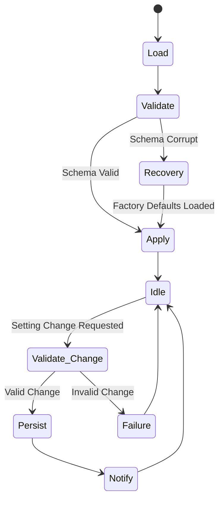

# 03 — Settings Lifecycle

> **Module:** Settings
> **Status:** Frozen
> **Version:** 1.0
> **Architecture Review:** Approved

---

## 1. Purpose

The Settings Lifecycle defines the execution flow for loading, validating, applying, and saving application configurations.

---

## 2. Lifecycle Phases

### 2.1 Load
On application startup, the Settings module reads the persisted configuration file (JSON/SQLite). Missing keys are hydrated with hardcoded defaults.

### 2.2 Validate
The loaded configuration is passed through schema validation. Unknown keys are ignored, and invalid types are reverted to safe defaults.

### 2.3 Apply (Runtime Memory)
The validated settings are cached in memory for synchronous, high-performance reads by consumer modules.

### 2.4 Persist
When a `Setting Change` occurs via the UI or an API, the new value is validated. If valid, it is written immediately to persistent storage.

### 2.5 Notify
Once successfully persisted, a `SettingChanged` event is broadcasted so active modules can react dynamically.

### 2.6 Recovery
If the persistence layer is corrupted (e.g., malformed JSON), the module falls back to factory defaults and generates a fresh, clean configuration.

### 2.7 Failure
If a change request fails validation, the Request is aborted, persistent storage is untouched, and an error is returned to the caller.

---

## 3. Lifecycle Diagram

---

## 4. Business Rules

- **Settings configure Notebook behavior.**
- **Settings validation protects application stability.**
- **Invalid settings are rejected safely.**

---

## 5. Acceptance Criteria

- Injecting a boolean into a string-type setting key via manual file edit results in the module reverting that specific key to its default value upon the next Load phase.
- Changing the Theme setting broadcasts a notification, and the UI reacts immediately without requiring an application restart.

---

## 6. Cross References

- [04-SettingsValidation.md](./04-SettingsValidation.md)
- [05-SettingsEvents.md](./05-SettingsEvents.md)
