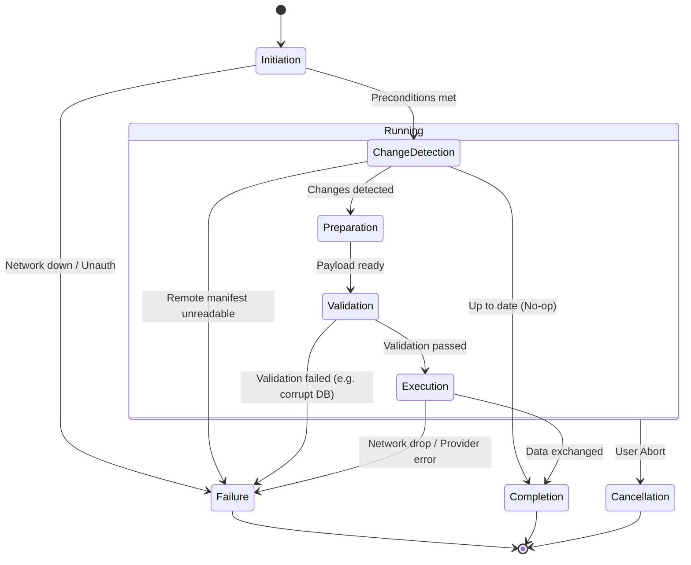

# 02 — Synchronization Lifecycle

> **Module:** Synchronization (Sync)
> **Status:** Frozen
> **Version:** 1.0
> **Architecture Review:** Approved

---

## 1. Purpose

This document defines the strict, sequential phases of a synchronization operation. The lifecycle ensures that synchronization happens safely, predictably, and consistently, regardless of which `ISyncProvider` is being used or what triggered the sync.

---

## 2. Lifecycle Phases

### 2.1 Synchronization Session Philosophy
A Synchronization Session is an ephemeral coordination activity. It exists only while synchronization is being performed. Sessions are not Notebook entities, and they may be recreated whenever synchronization is initiated.

Every synchronization operation moves through the following distinct phases.

### 2.2 Synchronization Initiation
Sync can be initiated manually by the user or automatically by a strategy (e.g., on application start, or debounced after a change). The initiation phase checks preconditions: is the network available, is the provider authenticated, and is a sync not already in progress.

### 2.3 Change Detection
The module determines if a sync is necessary and in which direction.
- Reads the local `manifest.json`.
- Requests the remote `manifest.json` from the provider.
- Compares the `syncVersion` and timestamps.

### 2.4 Preparation
Before data is exchanged, the module prepares the payload.
- It ensures the local database is flushed to disk (checkpointing WAL).
- It gathers a list of attachment files that have been modified or added.
- *Note: Preparation never locks the UI. The user can continue working.*

### 2.5 Validation
Data is validated to ensure it is safe to transmit or integrate.
- The local database integrity is verified.
- The remote manifest is checked to ensure it corresponds to the same `workspaceId`.
- **Rule:** Synchronization always validates data before exchange.

### 2.6 Synchronization Execution
The module coordinates with the `ISyncProvider` to perform the actual data exchange.
- Uploads or downloads the `database.db`.
- Uploads or downloads missing/modified files in the `attachments/` directory.

### 2.7 Completion
Upon successful data exchange:
- The local `manifest.json` is updated with a new `syncVersion` and `lastSyncAt` timestamp.
- The updated manifest is uploaded to the provider. Conceptually, the Workspace Manifest assists synchronization as metadata; it never replaces Notebook content or becomes the source of truth.
- A `SyncCompletedEvent` is published.

### 2.8 Failure
If an error occurs at any point (network drop, provider error, validation failure):
- The operation is immediately aborted.
- No partial manifest updates are applied.
- A `SyncFailedEvent` is published.
- **Rule:** Synchronization failures never corrupt Notebook entities.

### 2.9 Cancellation
If the user actively cancels the sync operation:
- The provider is instructed to abort active network streams.
- The local state remains exactly as it was before initiation.
- A `SyncCancelledEvent` is published.

---

## 3. Lifecycle Diagram

---

## 4. Business Rules

- **Synchronization never modifies Notebook ownership.** The lifecycle orchestrates movement; it does not claim ownership of the data being moved.
- **Synchronization always validates data before exchange.** An integrity check must pass before a local database is uploaded, preventing the spread of corruption.
- **Synchronization failures never corrupt Notebook entities.** Because sync operates on a snapshot (or treats the file as opaque), a failed upload or download does not impact the active working database.
- **The Manifest is the commit point.** A sync operation is only considered complete when the remote provider successfully receives the updated `manifest.json`.

---

## 5. Acceptance Criteria

- If the network drops during the Execution phase, the sync fails gracefully without altering the local `syncVersion`.
- If the local database fails the PRAGMA integrity check during Validation, the sync aborts and alerts the user, preventing a corrupt database from being uploaded to the remote provider.
- A user can click "Cancel" during a large attachment upload, terminating the operation immediately and publishing a `SyncCancelledEvent`.
- If Change Detection determines local and remote `syncVersion` are identical, the process transitions directly to Completion without unnecessary network usage.

---

## 6. Cross References

- [01-SynchronizationOverview.md](./01-SynchronizationOverview.md)
- [03-SynchronizationStrategies.md](./03-SynchronizationStrategies.md)
