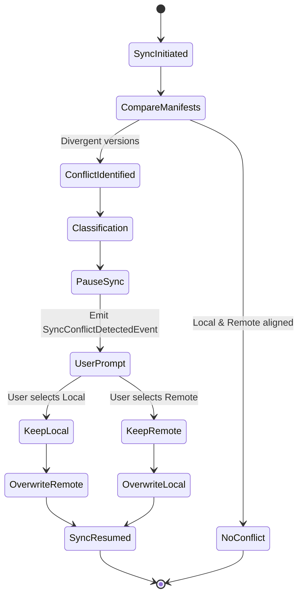

# 04 — Conflict Management

> **Module:** Synchronization (Sync)
> **Status:** Approved
> **Applies To:** Notebook Application

---

## 1. Purpose

The Conflict Management subsystem handles scenarios where multiple devices have independently modified the same Workspace data. Its purpose is to ensure that divergence between the local Workspace and the remote replica is identified, contained, and resolved safely.

---

## 2. Scope

**In Scope:**
- Detecting divergence via Workspace Manifest sync versions.
- Classifying conflicts (e.g., manifest divergence, file modification conflicts).
- Tracking the lifecycle of a detected conflict.
- Presenting resolution choices to the user.
- Enforcing manual resolution outcomes.

**Out of Scope:**
- Implementation of automated content-aware merge algorithms (e.g., three-way text merging) for V1.
- Direct manipulation of Notebook entities bypassing Domain constraints.

---

## 3. Conflict Philosophy

- **Conflict resolution determines how synchronization proceeds.** It dictates the resolution path but never changes ownership of Notebook entities.
- **Users remain the final authority.** The system **shall never** attempt to guess the user's intent when resolving a conflict that could result in data loss.
- **Conflict management never modifies Notebook entities automatically.** The synchronization engine halts and delegates the decision rather than silently overwriting data.
- **Notebook ownership always remains unchanged.** 
- **Preservation of integrity.** A conflict is a state of divergence, not a state of corruption. The local canonical data remains intact and functional while a conflict awaits resolution.

---

## 4. Conflict Lifecycle

Conflicts follow a strict lifecycle from identification to resolution.

### 4.1 Identification
During the Change Detection phase of synchronization, the system compares the local `manifest.json` against the remote `manifest.json`. A conflict is identified if the remote manifest contains a `syncVersion` for a device that is higher than the local system's recorded state, *and* the local system also has un-uploaded changes.

### 4.2 Classification
Conflicts are classified to determine the resolution path:
- **Attachment Conflict:** A raw file in `attachments/` was modified concurrently on two devices.
- **Database Conflict:** The `database.db` was written to concurrently by two devices.

### 4.3 Resolution Concepts
Resolution determines which version of the conflicting data becomes the canonical truth.

- **Manual Resolution:** The system halts synchronization and prompts the user. The user selects either "Keep Local Version" or "Accept Remote Version".
- **Automatic Resolution (Future):** Future enhancements may introduce safe automatic merging (e.g., CRDTs or row-level SQLite syncing). In V1, automatic resolution is strictly prohibited to prevent accidental data loss.

### 4.4 Reporting
When a conflict is identified, the synchronization process is safely paused, and a `SyncConflictDetectedEvent` is published to alert the UI.

---

## 5. Workflow

---

## 6. Business Rules

- **Users remain the final authority for conflict resolution.**
- **Conflict management coordinates conflict handling** but never directly executes entity updates outside the Application layer.
- **Conflict management never modifies Notebook entities automatically.**
- **Conflict handling preserves Notebook integrity.** A pending conflict must never lock the user out of reading their local Notebook.

---

## 7. Events

### Published Events
- `SyncConflictDetectedEvent`: Emitted when divergence is found. Payload includes conflict type and timestamps.
- `SyncConflictResolvedEvent`: Emitted when the user selects a resolution path.

### Consumed Events
- `UserConflictDecisionEvent`: Received from the UI when the user clicks "Keep Local" or "Keep Remote".

---

## 8. Error Handling & Edge Cases

- **Timeout during resolution:** If the user does not respond to a conflict prompt (e.g., they walk away from the computer), the sync operation gracefully times out and remains in a paused/aborted state. The local database continues to function normally.
- **Successive conflicts:** If the remote version changes again while the user is resolving a conflict, the cycle restarts to ensure the user is deciding against the latest remote state.

---

## 9. Acceptance Criteria

- When local and remote `database.db` files are both modified while offline, the next sync pauses and requires explicit user input.
- Selecting "Keep Local" successfully uploads the local database and increments the `syncVersion`, resolving the conflict.
- Selecting "Accept Remote" safely downloads the remote database, replaces the local database using the Application Service boundaries, and resolves the conflict.
- The application remains fully usable (reads and writes permitted) while a sync conflict is pending user resolution.

---

## 10. Cross References

- [01-SynchronizationOverview.md](./01-SynchronizationOverview.md)
- [Architecture: 12-SynchronizationArchitecture](../../01-architecture/12-SynchronizationArchitecture.md)
