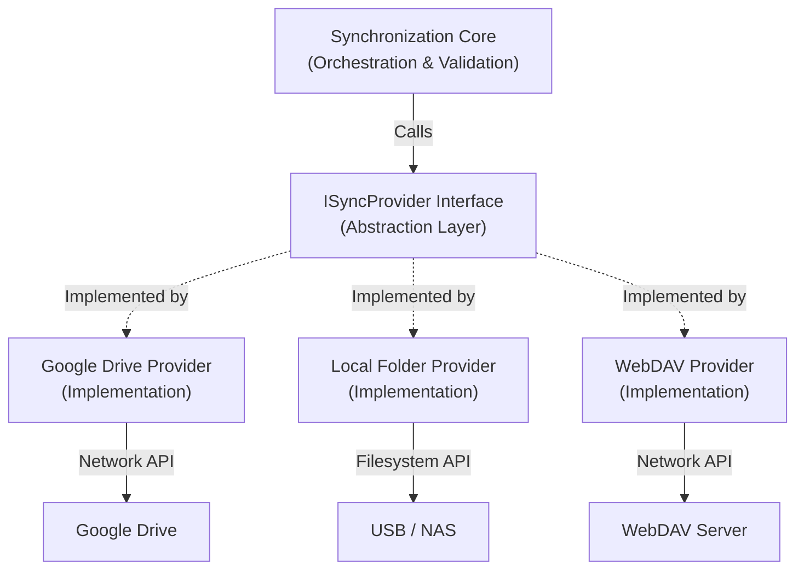

# 05 — Synchronization Providers

> **Module:** Synchronization (Sync)
> **Status:** Frozen
> **Version:** 1.0
> **Architecture Review:** Approved

---

## 1. Purpose

The Synchronization Providers subsystem defines the abstraction layer between the Notebook application and external storage mediums. Its purpose is to ensure that Notebook can synchronize data across diverse environments without tying the core architecture to any specific vendor, protocol, or cloud service.

---

## 2. Scope

**In Scope:**
- Definition of the `ISyncProvider` abstraction interface.
- Provider registration and lifecycle management.
- Contract for executing uploads, downloads, and manifest retrieval.
- Graceful error mapping from provider-specific errors to domain-agnostic sync errors.

**Out of Scope:**
- Specific implementation details of Google Drive, Dropbox, OneDrive, WebDAV, etc.
- Network protocol specifications (e.g., HTTP retry logic).
- Authentication flows (e.g., OAuth token refreshes). These are encapsulated entirely within the specific provider's implementation.

---

## 3. Provider Philosophy

- **Providers are execution adapters.** They are purely transport mechanisms that exchange Notebook data from point A to point B.
- **Providers never own Notebook entities.** A provider does not know what a "Note" or a "Todo" is. It only knows about `manifest.json`, `database.db`, and files in `attachments/`.
- **Providers never become the canonical source of truth.** Notebook entities always remain authoritative.
- **Providers remain interchangeable.** The synchronization core orchestrates the sync lifecycle without checking which provider is currently active.
- **Synchronization is provider-independent.** The core module dictates *when* to sync and *what* to validate; the provider dictates *how* to transmit the bytes.

---

## 4. Provider Lifecycle & Abstraction

### 4.1 The Abstraction Interface
All providers implement a strict interface that exposes capabilities such as:
- `connect()`: Initialize the connection.
- `getRemoteManifest()`: Fetch the remote `manifest.json`.
- `uploadFile()` / `downloadFile()`: Transfer opaque binaries.
- `disconnect()`: Clean up resources.

### 4.2 Registration and Replacement
Providers are registered with the module at runtime. The user selects an active provider via application settings. 
Because the interface is uniform, swapping from a Cloud Provider to a Local Folder provider requires zero changes to the core synchronization logic.

### 4.3 Examples of Conceptual Providers
- **Local Folder:** Synchronizes the Workspace to a USB drive or a local NAS directory.
- **Google Drive:** Synchronizes to a dedicated app folder in the user's Google Drive.
- **OneDrive / Dropbox:** Synchronizes via respective cloud APIs.
- **WebDAV:** Synchronizes to a user-hosted Nextcloud or ownCloud server.
- **Custom Provider:** A user-written plugin implementing `ISyncProvider`.

---

## 5. Workflow

---

## 6. Business Rules

- **Synchronization providers never own Notebook data.** They are strictly transport mechanisms.
- **Provider implementations remain replaceable.** Core synchronization logic **shall not** contain conditional statements checking for specific provider types.
- **Authentication is encapsulated.** The Synchronization module **shall not** manage or store provider-specific credentials. Providers must manage their own authentication state internally.
- **Error containment.** Providers **shall** catch their own network-specific errors (e.g., HTTP 429 Too Many Requests) and map them to standard generic sync errors before returning control to the core.

---

## 7. Future Provider Support

The abstraction guarantees that future providers can be integrated dynamically. As long as a provider implements the capabilities defined by the `ISyncProvider` interface, the Synchronization module will support it without modification. This is critical for the application's Plugin-first architectural goal.

---

## 8. Acceptance Criteria

- The synchronization engine successfully executes a full sync lifecycle using a mock, in-memory `ISyncProvider` during automated testing.
- Swapping the active provider in configuration instantly routes all subsequent sync operations to the new provider without requiring a restart.
- A provider throwing a vendor-specific network exception results in the core module receiving a generic `SyncProviderError`, preventing vendor-specific logic from leaking into the orchestrator.

---

## 9. Cross References

- [01-SynchronizationOverview.md](./01-SynchronizationOverview.md)
- [Architecture: 10-PluginArchitecture](../../01-architecture/10-PluginArchitecture.md)
- [Architecture: 12-SynchronizationArchitecture](../../01-architecture/12-SynchronizationArchitecture.md)
