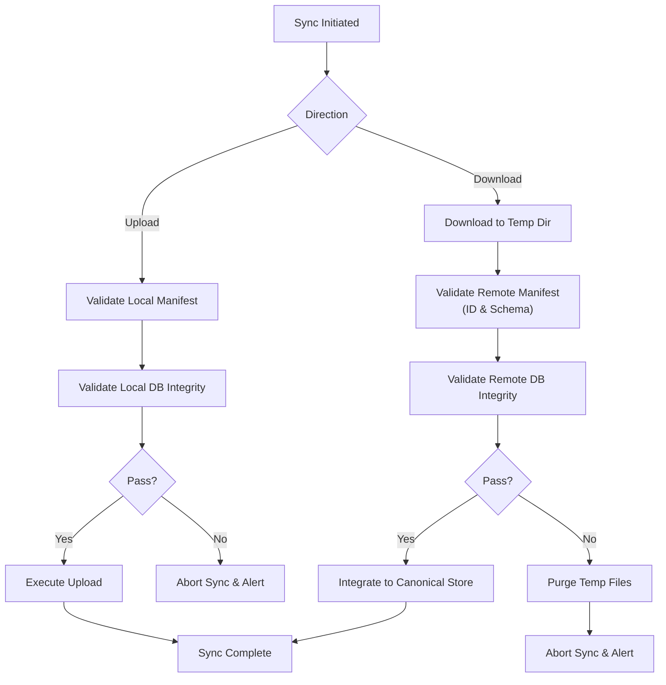

# 06 — Synchronization Validation

> **Module:** Synchronization (Sync)
> **Status:** Approved
> **Applies To:** Notebook Application

---

## 1. Purpose

The Synchronization Validation subsystem acts as the final gatekeeper protecting Notebook data integrity. Its purpose is to guarantee that no corrupt, malformed, or incompatible data is ever transmitted to a remote provider, nor integrated into the local canonical Workspace.

---

## 2. Scope

**In Scope:**
- Validating the local SQLite database and manifest before upload.
- Validating the remote SQLite database and manifest before download/integration.
- Verifying attachment file integrity (e.g., checksums or existence checks).
- Safe recovery paths when validation fails.

**Out of Scope:**
- Domain-level business rule validation of individual Notes (handled by the Domain layer).
- Fixing corrupted SQLite databases (validation detects and rejects; it does not repair).

---

## 3. Validation Philosophy

- **Validation protects Notebook integrity.** The highest priority of the synchronization module is ensuring that the user's data is never corrupted by a background process.
- **Validation occurs before and after synchronization.** Trust no data. The local payload is validated before it is sent; the remote payload is validated after it is downloaded but *before* it replaces the local data.
- **Synchronization is cancelled safely when validation fails.** A failed validation triggers an immediate, safe abort. 

---

## 4. Validation Phases

### 4.1 Pre-synchronization Validation (Outbound)
Before executing an upload:
1. **Manifest Integrity:** The local `manifest.json` is checked for required fields (Workspace ID, valid timestamps).
2. **Data Integrity:** The application ensures the SQLite database is not currently in a malformed state (e.g., executing a quick `PRAGMA integrity_check`).
3. **File Existence:** Ensuring that all attachments referenced in the database actually exist in the `attachments/` directory before attempting to upload them.

### 4.2 Post-synchronization Validation (Inbound)
Before integrating a downloaded payload into the local workspace:
1. **Manifest Verification:** The downloaded `manifest.json` must match the current Workspace ID (preventing accidental cross-workspace contamination).
2. **Schema Compatibility:** The remote manifest's `schemaVersion` is checked to ensure it is not from a future, incompatible version of the Notebook application.
3. **Data Integrity:** The downloaded `database.db` is subjected to a strict SQLite integrity check in a temporary directory *before* it replaces the canonical database.

### 4.3 Failure and Recovery Validation
If validation fails at any phase:
- The synchronization operation aborts.
- If it was an inbound validation failure, the downloaded temporary files are purged. The local canonical data remains untouched.
- If it was an outbound validation failure (e.g., local database corruption detected), the application halts sync and alerts the user to the integrity issue.
- **Rule:** Synchronization failures interrupt synchronization only. They never corrupt Notes, Attachments, OCR, Search indexes, Embeddings, or Todos. Notebook integrity must always be preserved.

---

## 5. Workflow

---

## 6. Business Rules

- **Validation protects Notebook integrity.** No unvalidated data may enter the canonical local store.
- **Validation occurs before and after synchronization.**
- **Synchronization failures never corrupt Notebook entities.** A failed inbound validation results in the destruction of the downloaded payload, leaving the local workspace exactly as it was.
- **Synchronization is cancelled safely when validation fails.**

---

## 7. Performance Considerations

Running `PRAGMA integrity_check` on very large databases can be resource-intensive. 
- Validation strategies may utilize `PRAGMA quick_check` for routine syncs to balance safety and performance.
- Inbound database validation happens in a background thread/process against the temporary downloaded file to ensure the UI does not block.

---

## 8. Acceptance Criteria

- Attempting to synchronize an inbound database file that has been artificially corrupted results in a validation failure; the local database is not overwritten.
- Downloading a remote manifest that belongs to a different `workspaceId` triggers an immediate validation failure and aborts the sync.
- Downloading a remote manifest with a `schemaVersion` higher than the application supports triggers a validation failure, alerting the user to update their application.

---

## 9. Cross References

- [02-SynchronizationLifecycle.md](./02-SynchronizationLifecycle.md)
- [Architecture: 15-WorkspaceManifest](../../01-architecture/15-WorkspaceManifest.md)
