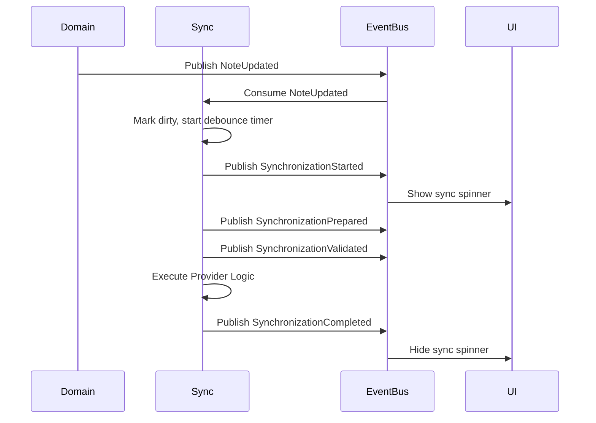

# 07 — Synchronization Events

> **Module:** Synchronization (Sync)
> **Status:** Approved
> **Applies To:** Notebook Application

---

## 1. Purpose

The Synchronization Events document defines the communication contract between the Synchronization module and the rest of the Notebook application. It ensures that synchronization state changes are broadcast safely and that the module reacts to Domain changes without tightly coupling to other modules.

---

## 2. Event Philosophy

- **Synchronization events communicate state.** They inform the UI and other modules about what is happening (e.g., syncing, failed, completed).
- **Events never transfer ownership.** An event may carry a payload (like a `workspaceId`), but it never transfers ownership of Notebook entities.
- **Events maintain loose coupling.** The Synchronization module does not call the UI directly; it broadcasts events. Similarly, it listens for Domain events rather than hooking directly into database triggers.
- **No implementation details.** Events are logical representations of domain activity, not network packets or REST API responses.

---

## 3. Published Events

The Synchronization module publishes these conceptual events to inform the broader application of its lifecycle state.

| Event | Description | Typical Payload |
|---|---|---|
| `SynchronizationStarted` | Broadcast when the sync lifecycle initiates. | `workspaceId`, `strategy`, `providerId` |
| `SynchronizationPrepared` | Broadcast after the payload is gathered. | `workspaceId`, `estimatedSize` |
| `SynchronizationValidated` | Broadcast after pre-sync validation passes. | `workspaceId` |
| `SynchronizationCompleted` | Broadcast upon successful commit to the manifest. | `workspaceId`, `bytesTransferred` |
| `SynchronizationCancelled` | Broadcast if the user aborts the operation safely. | `workspaceId` |
| `SynchronizationFailed` | Broadcast when sync aborts due to an error. | `workspaceId`, `errorCode` |
| `SynchronizationConflictDetected` | Broadcast when divergence requires user resolution. | `workspaceId`, `conflictType` |
| `SynchronizationConflictResolved` | Broadcast after the user resolves a pending conflict. | `workspaceId`, `resolutionAction` |
| `ProviderConnected` | Broadcast when an `ISyncProvider` successfully authenticates. | `providerId` |
| `ProviderDisconnected` | Broadcast when a provider session ends or fails auth. | `providerId` |

---

## 4. Consumed Events

The Synchronization module listens to these conceptual events published by the Domain layer to drive automatic (debounced) synchronization strategies.

| Event | Reaction from Synchronization Module |
|---|---|
| `NoteCreated`, `NoteUpdated`, `NoteDeleted` | Marks the Workspace as dirty; resets the automatic sync debounce timer. |
| `FolderCreated`, `FolderUpdated`, `FolderDeleted` | Marks the Workspace as dirty; resets the automatic sync debounce timer. |
| `AttachmentAdded`, `AttachmentRemoved` | Marks the Workspace as dirty; resets the automatic sync debounce timer. |
| `WorkspaceOpened` | Initializes the sync engine for the Workspace; may trigger startup sync. |
| `WorkspaceClosed` | Gracefully terminates active sync queues for the Workspace; may trigger shutdown sync. |

---

## 5. Event Lifecycle & Ordering

Event ordering follows the precise sequence of the Synchronization Lifecycle. 

---

## 6. Business Rules

- **Synchronization events communicate synchronization state.** They describe the progress of data movement, not the data itself.
- **Events never transfer ownership.**
- **Events maintain loose coupling between modules.** No other module may directly call the synchronization engine's internal methods.

---

## 7. Acceptance Criteria

- When a Note is updated, the Domain layer publishes a `NoteUpdated` event without any knowledge of the Synchronization module. The Synchronization module independently catches this event and initiates a debounced sync.
- If synchronization fails, the `SynchronizationFailed` event provides sufficient context for the UI to display a user-friendly error without the UI needing to inspect the sync engine's internal state.

---

## 8. Cross References

- [02-SynchronizationLifecycle.md](./02-SynchronizationLifecycle.md)
- [03-SynchronizationStrategies.md](./03-SynchronizationStrategies.md)
