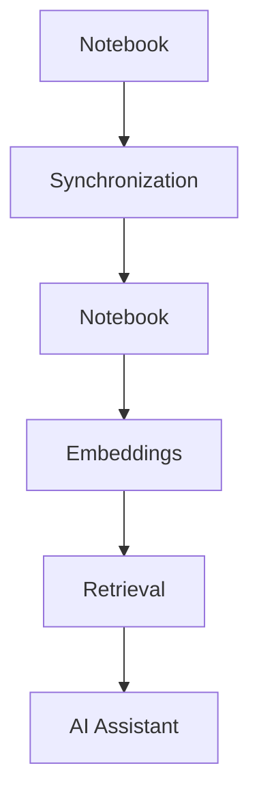
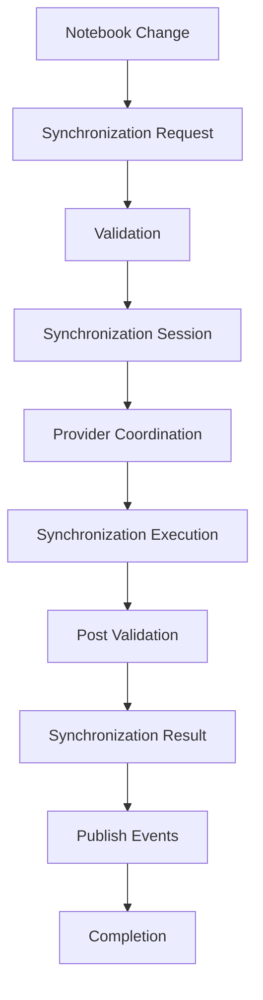

# 09 — Synchronization Governance

> **Module:** Synchronization (Sync)
> **Status:** Approved
> **Applies To:** Notebook Application

---

## 1. Purpose

The Synchronization Governance document establishes the strict boundaries, dependency rules, and ownership constraints for the Synchronization module. It guarantees that the Synchronization module coordinates data exchange without ever violating the architectural integrity of the Notebook ecosystem.

---

## 2. Ownership Boundaries

To preserve a clean architecture and prevent coupling, ownership boundaries are absolute.

### 2.1 Synchronization Owns:
- **Synchronization coordination:** Deciding when to sync based on strategies.
- **Synchronization lifecycle:** Managing the progression from initiation to completion.
- **Provider orchestration:** Managing the lifecycle and invocation of `ISyncProvider` implementations.
- **Synchronization validation:** Ensuring payloads are safe to send and receive.
- **Conflict coordination:** Detecting divergence and pausing for user resolution.

### 2.2 Synchronization Does NOT Own:
- **Workspace:** (Owned by Workspace Manager)
- **Folder:** (Owned by Folder Module)
- **Notes:** (Owned by Notes Module)
- **Attachments:** (Owned by Attachments Module)
- **Tags:** (Owned by Tags Module)
- **Search:** (Owned by Search Module)
- **OCR:** (Owned by OCR Subsystem)
- **Embeddings:** (Owned by Embeddings Subsystem)
- **AI Assistant:** (Owned by AI Module)
- **Todos:** (Owned by Todos Module)

---

## 3. Dependency Rules

- **Synchronization is infrastructure.** It sits in the Infrastructure / Application layer and acts upon the Domain; it is never part of the core Domain.
- **Dependencies point inward.** The Synchronization module depends on Domain interfaces (e.g., `IWorkspaceManifestManager`), but the Domain never depends on the Synchronization module.
- **No direct database mutation.** The Synchronization module never executes SQL `INSERT`, `UPDATE`, or `DELETE` statements against Notebook entities. If remote data must be merged, it is passed through standard Application Services.

---

## 4. AI Integration Interactions

Conceptually, the Synchronization module interacts with the AI subsystem as a pure transport layer:

Synchronization transports Notebook content. Synchronization does not synchronize AI context natively. The AI Assistant consumes synchronized Notebook content only after synchronization completes.

---

## 5. Canonical Synchronization Workflow

Every synchronization operation follows this canonical flow.

### 5.1 Workflow Clarifications
- **Each stage has a single owner.**
- **Ownership never transfers.**
- **Synchronization coordinates data movement without becoming the owner of Notebook entities.**
- **Providers execute synchronization without becoming canonical.**
- **Notebook data always remains the source of truth.**

---

## 6. Business Rules

- **Synchronization is infrastructure.** It supports the application but is not the core domain.
- **Notebook remains offline-first.** Synchronization is a background enhancement.
- **Synchronization is optional.** The application must function flawlessly if sync is permanently disabled.
- **Synchronization never owns Notebook entities.** Ownership stays in the Domain.
- **Synchronization providers remain replaceable.** The architecture is decoupled from any single vendor.
- **Synchronization failures interrupt synchronization only.** They never corrupt Notes, Attachments, OCR, Search indexes, Embeddings, or Todos. Notebook integrity must always be preserved.
- **Ownership never transfers.** Sync never assumes authoritative ownership over a user's data.

---

## 7. Acceptance Criteria

- An architectural linter or dependency graph analysis demonstrates that the Domain layer has zero dependencies on the Synchronization module.
- The UI can fully operate, create notes, and manage folders while the Synchronization module is mocked, disabled, or failing.
- A code review of the Synchronization module reveals zero direct SQL queries against Domain tables (e.g., `Notes`, `Folders`).

---

## 7. Cross References

- [README.md](./README.md)
- [01-SynchronizationOverview.md](./01-SynchronizationOverview.md)
- [04-ConflictManagement.md](./04-ConflictManagement.md)
- [06-SynchronizationValidation.md](./06-SynchronizationValidation.md)
- [Architecture: 02-CleanArchitecture](../../01-architecture/02-CleanArchitecture.md)
