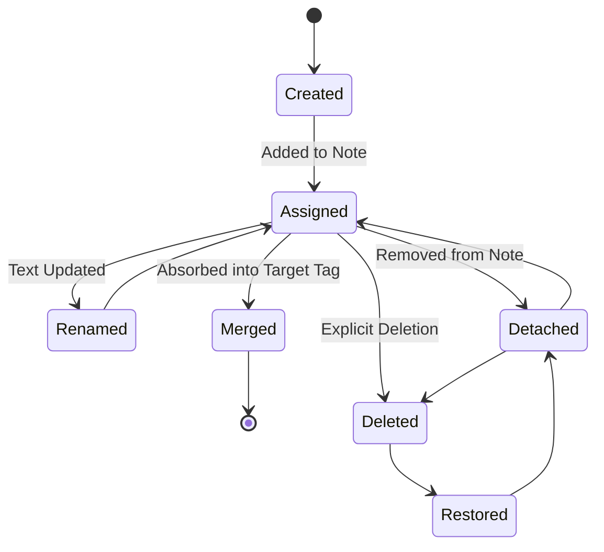

> **Document Type:** Module Specification
> **Status:** Draft
> **Version:** 1.0
> **Depends On:** Tags Module Overview
> **Document Owner:** Core Architecture Team

# 02 — Tag Lifecycle

---

## 1. Purpose

This document tracks the conceptual lifecycle of a Tag, demonstrating how it transitions through various states and how mutations affect the broader ecosystem.

## 2. Lifecycle Operations

### 2.1 Create
- A Tag is created (either explicitly in a Tag Manager UI, or implicitly when a user types a new tag string in a Note). A UUID is minted.

### 2.2 Assign
- A relationship is formed between a Note UUID and the Tag UUID.

### 2.3 Rename
- The Tag's textual name property is updated. The UUID remains identical. All assigned Notes immediately reflect the new name.

### 2.4 Merge
- Two distinct Tags (e.g., `#js` and `#javascript`) are combined into one.
- **Tag Merge Philosophy:**
  - Relationships from all merged Tags are preserved.
  - The surviving Tag (the target) remains the canonical Tag.
  - The obsolete Tag identity (the source) is retired and permanently deleted.
  - No Notes are deleted during a merge.
  - The merge operation guarantees relationship integrity, ensuring all Notes previously attached to the source Tag are safely reassigned to the target Tag without duplication.

### 2.5 Split (Future)
- A single Tag is divided into two new distinct Tags, requiring the user to allocate the existing relationships.

### 2.6 Detach
- A relationship is severed (e.g., the user deletes the tag string from the Note).

### 2.7 Archive (Future)
- A Tag is hidden from autocomplete UI and sidebars, but relationships remain intact for historical preservation.

### 2.8 Delete
- The Tag entity is permanently destroyed. All Note relationships pointing to this Tag are removed.
- **CRITICAL RULE:** Deleting a Tag removes the relationship but NEVER deletes Notes.

### 2.9 Restore
- If soft-deletion is supported, the Tag and its relationships can be recovered from the Trash.

### 2.10 Import / Export
- **Import:** The system parses incoming text for `#tag` syntax, creating Tags and relationships as needed.
- **Export:** The system resolves Tag UUIDs back to raw text strings (e.g., `#meeting`) in the exported Markdown to ensure data portability.

## 3. Lifecycle Diagrams

## 4. Business Rules

- **Safe Deletion:** A user can safely delete the `#taxes-2023` tag without fear of losing the actual financial Notes it was attached to.
- **Merge Integrity:** Merging Tags must seamlessly deduplicate relationships (if a Note had both `#js` and `#javascript`, the merge results in a single `#javascript` relationship).

## 5. Edge Cases

- **Empty Names:** A Tag cannot be renamed to an empty string. Validation must block this lifecycle transition.

## 6. Acceptance Criteria

- Merging `#todo` into `#tasks` results in all Notes previously tagged `#todo` now surfacing when querying for `#tasks`.
- Deleting a Tag completely removes it from the global registry but leaves all previously tagged Notes accessible in their respective Folders.
