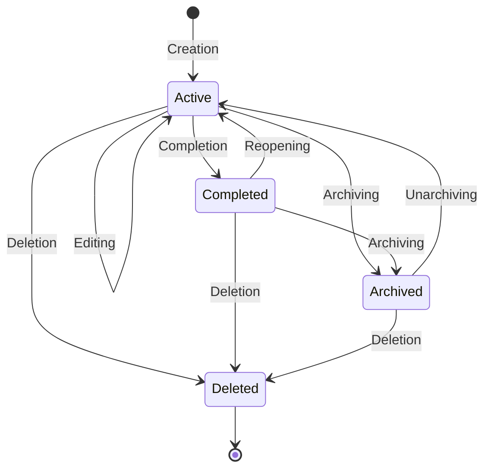

> **Document Type:** Module Specification
> **Status:** Frozen
> **Version:** 1.0
> **Depends On:** Todos Module
> **Document Owner:** Core Architecture Team

# 02 — Todo Lifecycle

---

## 1. Purpose

This document defines the lifecycle states of a Todo entity and the transitions between them. It establishes the rules governing how a Todo evolves from creation to completion, archiving, or deletion, while ensuring absolute safety for any linked canonical entities.

## 2. Lifecycle Stages

### 2.1 Creation
- A Todo is instantiated with a required text description.
- Optional metadata (due date, priority, list assignment) and references (e.g., linked Notes) may be applied at creation.
- The default state upon creation is `Active`.

### 2.2 Editing
- The user may modify a Todo's description, metadata, or relationships while it is in the `Active` state.
- **Rule:** Editing a Todo's reference to a Note (e.g., changing which Note it points to) only updates the Todo's pointer. It NEVER modifies the linked Notes.

### 2.3 Completion
- A Todo is marked as `Completed` when the actionable intent is fulfilled.
- Completion is a state transition recorded on the Todo entity.
- **Todo Completion Philosophy:** Completing a Todo only changes the Todo lifecycle. It NEVER completes a Note, archives a Note, modifies Notebook content, or changes linked entities. Notebook entities remain fully independent.
- **Rule:** If a Todo linked to "Meeting Agenda" is completed, the "Meeting Agenda" Note remains byte-for-byte identical.

### 2.4 Reopening
- A `Completed` Todo may be reverted back to the `Active` state.
- This transition removes the completion timestamp and restores the task's actionable status.

### 2.5 Archiving
- An `Active` or `Completed` Todo may be transitioned to the `Archived` state.
- Archiving removes the Todo from default active views to reduce clutter without permanently destroying the data.
- Archived Todos remain retrievable via explicit search or filter operations.

### 2.6 Deletion
- A Todo may be permanently removed from the system.
- **Rule:** Deletion is strictly localized. Deleting a Todo removes its metadata and relationships but NEVER deletes or modifies any referenced canonical entity.

## 3. Lifecycle Diagram

## 4. Business Rules

- **State Locality:** All lifecycle state transitions (Creation, Completion, Archiving, Deletion) apply exclusively to the Todo entity itself.
- **Referential Safety:** No lifecycle event on a Todo causes a cascading modification to a referenced Note, Folder, or Tag. 
- **Immutable History (Optional):** Changes to a Todo's state may emit events (`TodoCompleted`, `TodoReopened`) that can be used by an auditing or history module, but the Todo module itself is only responsible for the current state.

## 5. Edge Cases

- **Linked Note Deleted:** If an `Active` Todo references a Note, and that Note is permanently deleted by the Notes module, the Todo remains `Active`. Its reference is either nullified or marked as a "dangling link" to be handled gracefully by the UI. The Todo itself is not deleted.
- **Workspace Deletion:** If the parent Workspace is deleted, the Workspace module's cascading deletion protocol handles the destruction of all Todos within it.

## 6. Acceptance Criteria

- When a user clicks a checkbox to complete a Todo that references "Project Alpha", the Todo's state becomes `Completed`, the `TodoCompleted` event is fired, and "Project Alpha" is completely untouched.
- When a user deletes a Todo, the Todo is removed from the database, but all Notes it referenced remain intact.
- An archived Todo no longer appears in the "Today's Tasks" view, but remains accessible via an explicit "View Archive" query.
