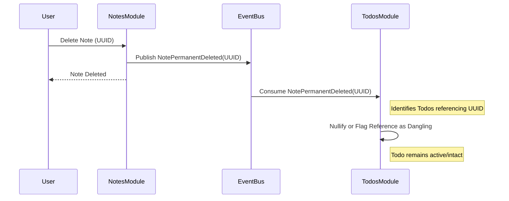

> **Document Type:** Module Specification
> **Status:** Draft
> **Version:** 1.0
> **Depends On:** Todos Module, Notes, Folders, Tags
> **Document Owner:** Core Architecture Team

# 04 — Todo Relationships

---

## 1. Purpose

This document defines the relationships between Todos and other canonical entities within the Notebook ecosystem. It establishes the rules for how Todos reference knowledge artifacts (like Notes or Folders) while preserving strict independence, ensuring that action management never corrupts knowledge management.

## 2. Relationship Philosophy

Todos are fundamentally independent execution entities. However, tasks rarely exist in a vacuum; they often relate to specific knowledge contexts. The Notebook architecture supports optional, unidirectional references from Todos to other canonical entities.

- **Unidirectional Pointer:** A relationship is a pointer from a Todo to a target entity. 
- **Optionality:** Relationships are never required for a Todo to exist.
- **Reference Only:** Relationships denote relevance or context. They do NOT denote ownership, composition, or lifecycle cascading.

## 3. Supported Relationships

A single Todo may maintain zero, one, or multiple references to the following canonical entities:

- **Notes:** Linking an actionable task to a specific Note (e.g., "Review meeting minutes" linked to the "Weekly Sync" Note).
- **Folders:** Linking a Todo to an entire Folder to denote broader context (e.g., "Organize files" linked to the "Q3 Projects" Folder).
- **Tags:** Associating a Todo with a canonical Notebook Tag to align task taxonomy with knowledge taxonomy.
- **Attachments (Future):** Linking a Todo directly to a file (e.g., "Sign contract" linked to a PDF attachment).

## 4. Reference Ownership

- **Todo Module Owns the Link:** The structural record of the relationship (the foreign key or reference UUID) is owned entirely by the Todos module.
- **Target Modules Own the Content:** The Notes, Folders, and Tags modules completely own their respective entities. 
- **Rule:** A Todo NEVER owns the entity it references.

## 5. Relationship Lifecycle

### 5.1 Link Creation
- A reference is established when a user explicitly links a Todo to a target entity.
- Creating this link updates the Todo's metadata. It DOES NOT modify the target entity's content or metadata.

### 5.2 Link Modification
- The user may add or remove references on a Todo at any time.
- Removing a link severs the reference within the Todo. The target entity remains unaffected.

### 5.3 Relationship Consistency
- Because relationships are loose pointers, they must be resilient to changes in the target domain.
- The Todos module achieves consistency by consuming upstream lifecycle events (e.g., `NotePermanentDeleted`).
- If a target entity is permanently deleted, the Todos module must gracefully handle the "dangling reference." 

## 6. Business Rules

- **Independence:** Todos remain independent Notebook entities regardless of their relationships.
- **References Only:** Relationships are read-only references from the perspective of the Todo. 
- **No Cascade Deletion:** Deleting a referenced entity MUST NEVER trigger the deletion of the referencing Todo.
- **No Cascade Modification:** Completing, archiving, or editing a Todo MUST NEVER modify the content or state of the referenced entities.

## 7. Workflow: Handling Target Deletion

## 8. Edge Cases

- **Target Entity Unavailable:** If a target entity cannot be resolved (due to temporary storage issues or sync conflicts), the Todo remains fully functional. The UI must gracefully display the reference as "Unavailable."
- **Exporting/Syncing:** When exporting a Todo list, references to internal Notebook entities may become unresolvable outside the Notebook ecosystem. Exporters must handle this by extracting textual context or omitting the link.

## 9. Future Enhancements

- **Bidirectional UI Surfacing:** While the structural reference is unidirectional (Todo -> Note), the UI could query the Todos module to display a list of "Related Tasks" at the bottom of a Note, providing contextual awareness without altering the Note's database record.

## 10. Acceptance Criteria

- A user links a Todo to a Note. The database confirms the relationship is recorded exclusively in the Todos domain, with no modifications to the Notes domain.
- A user permanently deletes a Note that is referenced by three active Todos. The three Todos remain active and their task text is preserved. The UI displays the referenced Note as "Deleted."
- A user marks a Todo linked to a Folder as `Completed`. The Folder and all its contents remain entirely unchanged.

## 11. Cross References

- [README.md](./README.md)
- [01-TodosOverview.md](./01-TodosOverview.md)
- [02-TodoLifecycle.md](./02-TodoLifecycle.md)
