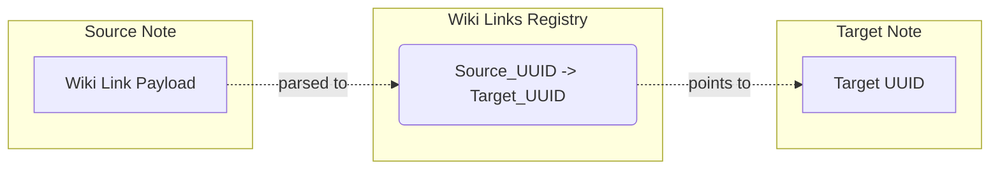

> **Document Type:** Module Specification
> **Status:** Draft
> **Version:** 1.0
> **Depends On:** Notes Module
> **Document Owner:** Core Architecture Team

# 01 — Wiki Links

---

## 1. Purpose

This document defines the core concept of a Wiki Link within the Notebook application. It details how forward relationships are established and maintained securely against Note mutations.

## 2. Concept

A Wiki Link is a directed relationship from a Source Note to a Target Note. It empowers users to weave disparate thoughts into a connected network of knowledge.

## 3. Ownership

- The **Wiki Links module** owns the graph registry and validation of the links.
- The **Notes module** owns the persistent content containing the link syntax/payload.

## 4. Link Identity and Integrity

### 4.1 UUID Referencing
- **Rule:** Wiki Links reference immutable Note UUIDs.
- While the user interface or markdown syntax (e.g., `[[My Target Note]]`) might display the Note's title, the underlying semantic payload or database mapping MUST rely on the Target Note's UUID.

### 4.2 Safe Mutations
- **Renaming Notes:** Because links rely on UUIDs, changing the title of a Target Note NEVER invalidates existing links. The UI may automatically update the display text of the link, but the link identity remains intact.
- **Moving Notes:** Because links rely on UUIDs (not file paths), moving a Target Note to a new Folder NEVER breaks links.

## 5. Lifecycle Interactions

- **Creating Links:** When a user types a link (or uses an autocomplete UI) and saves the Note, the Notes module emits an event. The Wiki Links module parses the content, extracts the link, and registers the relationship.
- **Removing Links:** Removing the link from the text and saving destroys the relationship in the graph.
- **Broken Links:** If the Target Note is deleted, the link becomes a "Broken Link". The text remains in the Source Note, but clicking it typically prompts the user to create a new Note with that name/concept.

## 6. Business Rules

- **Titles are Presentation Only:** The title of the Note is merely a human-readable label. It does not dictate the integrity of the link.
- **Link Display Names:** The UI presents the current title of the Target Note.
- **Aliases (Future):** Users may define an alias (e.g., `[[UUID|Custom Display Text]]`) to override the display name while maintaining the UUID link.

## 7. Mermaid Diagrams

## 8. Acceptance Criteria

- Creating a link `[[Project Alpha]]` correctly binds to the UUID of the "Project Alpha" Note.
- Renaming "Project Alpha" to "Project Beta" does not break the link; clicking it still navigates to the correct Note.
- Moving the target Note to a different folder does not break the link.
