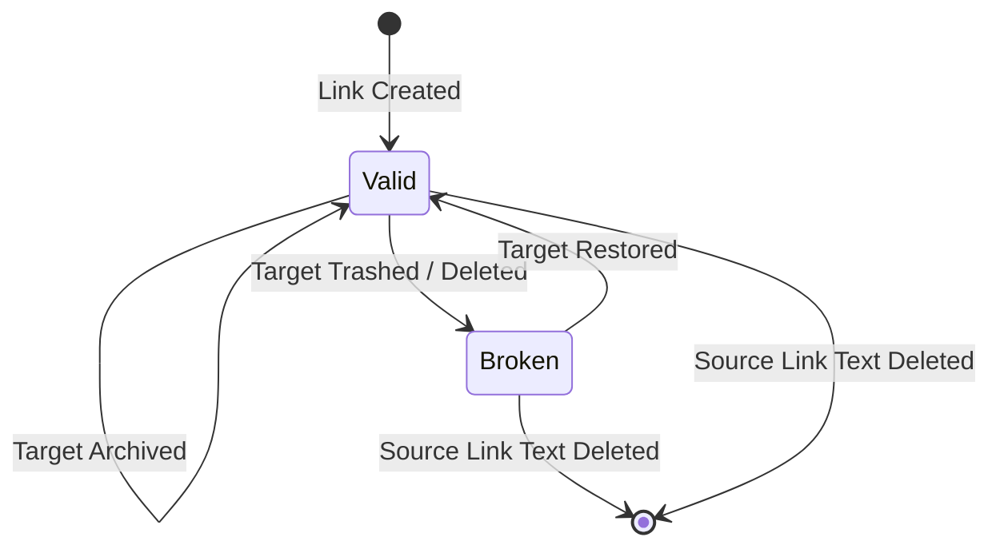

> **Document Type:** Module Specification
> **Status:** Draft
> **Version:** 1.0
> **Depends On:** Notes Module
> **Document Owner:** Core Architecture Team

# 04 — Link Lifecycle

---

## 1. Purpose

This document tracks the conceptual lifecycle of a Wiki Link relationship, demonstrating how the link reacts to mutations in its source and target Notes.

## 2. Core Rule

- **Stable Identity:** Link identity remains stable as long as the target Note exists.

## 3. Lifecycle States

### 3.1 Create
- The user inserts link syntax. The Note saves. The Wiki Links module parses the payload and creates a directed edge in the graph.

### 3.2 Update
- **Target Rename:** The target Note title changes. The link UUID remains identical. The UI automatically reflects the new name. No graph topology changes.
- **Target Move:** The target Note moves to a new folder. Link remains identical.
- **Source Edit:** The user edits the text *around* the link in the source Note. The link relationship is untouched.

### 3.3 Target State Changes
- **Archive Target:** Target is archived. Link remains valid but may change visual state.
- **Trash Target:** Target is soft-deleted. Link transitions to `Broken`. Backlinks are hidden.
- **Restore Target:** Target is un-trashed. Link transitions back to `Valid`. Backlinks are restored.
- **Delete Target:** Target is permanently destroyed. Link transitions permanently to `Broken`.

### 3.4 Data Portability
- **Import:** When Notes are imported, the Import module must parse any incoming text strings that look like Wiki Links, attempt to match them to newly imported Notes, and swap the text strings for valid Notebook UUIDs.
- **Export:** When exported to standard Markdown, the UUID must be swapped back into a human-readable string (e.g., the target Note's title) or a relative file path to ensure the exported files remain linked on the local filesystem.

## 4. Lifecycle Diagrams

## 5. Edge Cases

- **Split Brain (Sync):** If a target Note is deleted on Device A, and linked on Device B while offline, when they sync, the link on Device B becomes broken. This is correct behavior.

## 6. Acceptance Criteria

- Renaming a target Note updates the UI for all incoming links without breaking the graph.
- Exporting a connected set of Notes produces Markdown files with standard `[Title](file.md)` links, stripping the internal UUID representation for maximum portability.
