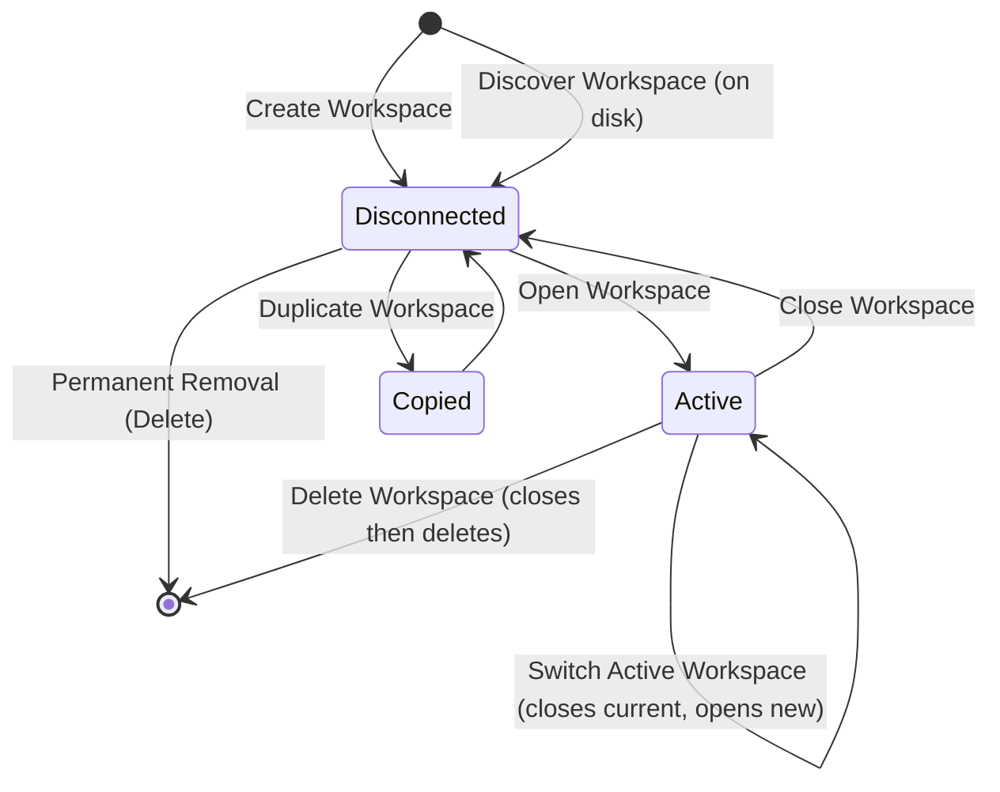

# 01 — Workspace Lifecycle

> **Document Type:** Module Specification
> **Module:** workspace
> **Status:** Draft
> **Version:** 1.0
> **Applies To:** Notebook — All Versions
> **Related Documents:**
> [README.md](./README.md) · [02-WorkspaceManagement.md](./02-WorkspaceManagement.md)

---

## 1. Purpose

This document defines the complete lifecycle of a Workspace entity within the Notebook application. It describes the states a Workspace transitions through from its initial creation, to its active use, closure, and eventual permanent deletion. Understanding the Workspace lifecycle is essential as it governs when other modules can interact with user data.

---

## 2. Scope

**This document covers:**
- The conceptual states of a Workspace.
- State transitions (Create, Open, Close, Rename, Duplicate, Delete, Restore).
- The definition of the "Active Workspace".

**This document does NOT cover:**
- Detailed execution workflows for management operations (see `02-WorkspaceManagement.md`).
- Backup and sync lifecycles.
- Migration and recovery states (see `07-WorkspaceRecovery.md`).

---

## 3. Responsibilities

This specification is responsible for defining the state machine of the Workspace context.

---

## 4. State Transitions

The lifecycle of a Workspace on a user's machine follows this state machine:

| State | Meaning |
|---|---|
| **Disconnected** | The Workspace exists on disk (has a valid `manifest.json`) but is not currently loaded into memory, and its database is not connected. |
| **Active** | The Workspace is open. Its database connection is established, and it is the current context for the UI and other application modules. |
| **Copied** | A transient state where the Workspace directory is being duplicated. |

---

## 5. Lifecycle Stages

### 5.1 Creation
A Workspace begins its lifecycle when the user initiates a Create operation. The application provisions a new directory structure, writes the initial `manifest.json` (assigning a stable UUID), and creates the empty SQLite `database.db`. Upon successful creation, the Workspace transitions immediately to the **Active** state.

### 5.2 Opening (Active State)
When a user selects a Workspace from the recent list or opens one from the filesystem, it transitions from **Disconnected** to **Active**. During this transition, the system:
1. Validates the `manifest.json`.
2. Evaluates schema versions.
3. Applies database migrations if necessary (and safe).
4. Establishes the Prisma client connection.

While **Active**, all other modules (Notes, Folders, AI, etc.) are permitted to read and write to the Workspace.

### 5.3 Closing
When the user switches to a different Workspace or closes the application, the active Workspace transitions to **Disconnected**. 
- Pending writes are flushed.
- Background jobs (like embeddings) are gracefully paused or completed.
- The database connection is closed.
- The UI drops its context.

### 5.4 Renaming
Renaming a Workspace updates its display name in the `manifest.json`. This can happen while the Workspace is **Active**. It does not change the directory name or the Workspace UUID. 

### 5.5 Duplication
A user may duplicate a Workspace (e.g., to create a sandbox). The duplicate becomes a completely new, distinct Workspace with a new UUID generated in its `manifest.json`, but containing a copy of all data at the time of duplication. The duplicate starts in the **Disconnected** state.

### 5.6 Permanent Removal (Deletion)
Deletion can be triggered on an Active or Disconnected Workspace. If Active, the Workspace is first Closed. Deletion permanently removes the Workspace directory and all its contents (database, attachments, manifest, backups) from the filesystem. This is a destructive, non-recoverable operation (unless the user has a separate Google Drive sync or off-disk backup).

---

## 6. Archiving and Restoring (Future)

*Archiving is currently deferred.* 
In the future, an "Archived" state may be introduced where a Workspace is compressed into a single read-only file format to save space and remove it from the recent list, requiring a "Restore" transition to become Disconnected/Active again. Currently, users can achieve this via the Export functionality.

---

## 7. Workspace Locking

**Design Principles:**
- Prevent multiple Notebook instances from writing to the same Workspace simultaneously.
- SQLite provides database-level locking natively.
- The application should additionally maintain a lightweight Workspace lock mechanism to improve user experience.
- Detect already-open Workspaces gracefully.

**Expected Behavior:**
- If a Workspace is already open, the application should warn the user and prevent opening it again in a new instance to avoid conflicts.
- **Stale Lock Recovery:** After an unexpected crash, a stale lock may persist. The system should detect this (e.g., by checking if the process holding the lock is still alive) and offer a mechanism to recover and safely acquire the lock.

---

## 8. Workspace Health

A Workspace can exist in one of several health states:

- **Healthy:** The `manifest.json`, `database.db`, and all required directories are present, accessible, and valid.
- **Warning:** Non-critical issues detected, such as missing caches or recoverable missing non-essential attachments. Action: Automatic validation opportunities should run in the background.
- **Error:** Significant issues detected, such as an inaccessible `attachments` directory due to permissions, or a failed migration. Action: User intervention is required to restore permissions or fix paths.
- **Corrupted:** Critical components are missing or unreadable, such as a missing `database.db` or malformed `manifest.json`. Action: Relationship with Workspace Recovery is triggered; user is prompted to restore from a backup or run a repair tool.

---

## 9. Business Rules

- **Single Active Workspace:** Only one Workspace can be in the **Active** state per application window session.
- **Identity Permanence:** A Workspace's identity is defined by the `id` field in its `manifest.json`. Moving the directory on the filesystem does not change its identity or state machine.
- **Destructive Deletion:** Deletion bypasses the OS trash bin for data security; it is a permanent file removal.

---

## 10. Acceptance Criteria

- [ ] A Workspace can transition from Create -> Active -> Close -> Disconnected.
- [ ] Deleting an Active workspace successfully closes connections before removing files.
- [ ] The system accurately identifies when a Workspace is currently Active and prevents conflicting access.
