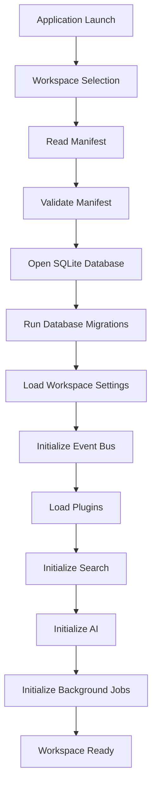
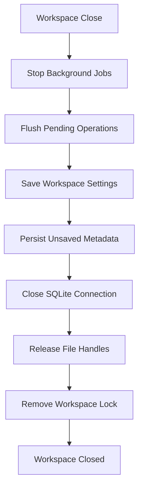

# 08 — Workspace Startup & Shutdown

> **Document Type:** Module Specification
> **Module:** workspace
> **Status:** Frozen
> **Version:** 1.0
> **Architecture Review:** Approved

---

## 1. Purpose

This document details the exact sequence of events required to properly initialize (startup) and safely terminate (shutdown) a Workspace. 

---

## 2. Startup Sequence

The following sequence describes the stages a Workspace goes through to become Active.

**Responsibilities of each stage:**
- **Application Launch:** The main application process starts.
- **Workspace Selection:** The user selects a Workspace from the Recent list or filesystem.
- **Read Manifest:** Reads the `manifest.json` file.
- **Validate Manifest:** Ensures the directory is a valid Workspace and schema version is supported.
- **Open SQLite Database:** Establishes the primary data connection.
- **Run Database Migrations:** Applies any pending schema updates safely.
- **Load Workspace Settings:** Applies Workspace-specific configurations.
- **Initialize Event Bus:** Prepares the pub/sub system for Domain and System events.
- **Load Plugins:** Initializes any Workspace-specific extensions.
- **Initialize Search:** Connects to the FTS indexes and prepares the search service.
- **Initialize AI:** Loads embeddings connections and AI model contexts.
- **Initialize Background Jobs:** Starts queues for processing (e.g., OCR, Sync).
- **Workspace Ready:** The UI is rendered and the Workspace is Active.

---

## 3. Shutdown Sequence

A graceful shutdown is critical to ensure data integrity and prevent corruption or stale locks.

**Why graceful shutdown is important:**
- Prevents database corruption by ensuring all WAL (Write-Ahead Log) checkpoints complete.
- Avoids stale locks that could prevent the Workspace from being opened later.
- Ensures all background operations (e.g., autosaves, OCR) pause cleanly without data loss.
