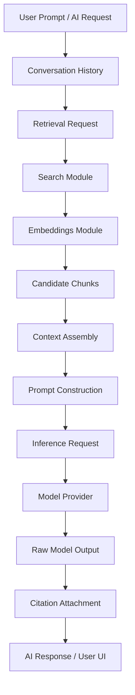

# 01 — AI Architecture

> **Module:** AI & RAG
> **Status:** Frozen
> **Version:** 1.0
> **Architecture Review:** Approved
> **Applies To:** Notebook Application

---

## 1. Purpose

The AI Architecture document describes the overarching structural relationship between the core Notebook data and the AI generation pipelines. It establishes the flow of data from canonical storage to an AI model and back to the user.

---

## 2. Overall Architecture

The AI subsystem operates as an orchestration layer. It bridges the gap between raw user prompts and the Notebook's structured knowledge base through a unified, unidirectional pipeline.

### 2.1 The Canonical Workflow

1. **User Prompt:** The user submits a natural language request.
2. **Conversation History:** The system retrieves recent chat context.
3. **Retrieval Request:** The AI module formulates a search query based on the prompt.
4. **Search:** The request is passed to the Search module.
5. **Embeddings:** The Search module utilizes the Embeddings module for semantic matching.
6. **Candidate Chunks:** A ranked list of relevant text fragments is returned.
7. **Context Assembly:** Chunks are formatted into a unified Context Package.
8. **Prompt Construction:** The Context Package, Conversation History, and User Prompt are combined with System Instructions.
9. **Model Inference:** The final prompt is sent to the abstracted Model Provider.
10. **Generated Response:** The model streams back its completion.
11. **Citation Attachment:** The system maps the response back to the originating Candidate Chunks to provide references.
12. **User:** The final cited response is rendered in the UI.

---

## 3. Conceptual Identities

- **AI Request:** The high-level intent initiated by the user. The AI module orchestrates this request from start to finish.
- **Retrieval Request:** A specific sub-operation where the AI module queries the Search module for context. The Search module owns the execution of this request.
- **Inference Request:** The payload sent to the abstracted Model Provider containing the Final Prompt.
- **Raw Model Output:** The raw stream of tokens returned by the Model Provider.
- **Citation Attachment:** An enrichment step that maps the Raw Model Output back to Candidate Chunks.
- **AI Response:** The final, processed, cited output presented to the user.

Model output is transformed into an AI Response. Citation attachment enriches the response. Neither becomes Notebook entities automatically.

---

## 4. Ownership and Boundaries

- **Strict Boundaries:** Every stage in the workflow has exactly one owner. The AI module orchestrates the flow but relies on the Search module for retrieval and the Notes domain for canonical content.
- **Ownership Never Transfers:** When the Search module returns Candidate Chunks, the AI module temporarily holds them in memory as an ephemeral Context Package. It does not take ownership of the underlying Note.
- **Derived Artifacts:** Context Packages, Prompts, and AI Responses are ephemeral, derived artifacts. They exist to serve the user in the moment and never overwrite canonical Notebook entities.

---

## 5. Business Rules

- **Every stage has one owner.**
- **Ownership never transfers.**
- **Notebook entities remain the canonical source of truth.**

---

## 6. Architectural Diagram

---

## 7. Acceptance Criteria

- The architecture explicitly isolates the model inference step from direct database access.
- Changes to the embedding model only affect the Embeddings module, requiring no architectural changes to the Prompt Construction phase.

---

## 7. Cross References

- [02-RAGPipeline.md](./02-RAGPipeline.md)
- [04-PromptConstruction.md](./04-PromptConstruction.md)
