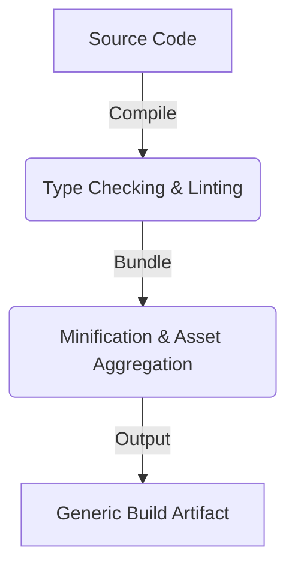

# 01 — Build Architecture

> **Module:** Build, Packaging & Release
> **Status:** Frozen
> **Version:** 1.0
> **Architecture Review:** Approved
> **Applies To:** Notebook Application

---

## 1. Purpose

The Build Architecture document defines the conceptual philosophy and rules for transforming raw source code into a runnable, testable artifact independent of any specific framework.

---

## 2. Scope

Covers the conceptual rules for compiling source code, handling internal assets, generating intermediate artifacts, and ensuring build reproducibility.

---

## 3. Conceptual Strategy

### 3.1 Build Philosophy
- **Separation of Concerns:** The build process is entirely separated from the deployment process. A built artifact must be capable of running in testing, staging, or production environments solely based on its runtime configuration.

### 3.2 Build Reproducibility
- **Deterministic Compilation:** The build pipeline must pin all dependency versions strictly. Building the same Git commit on different days or different CI runners must yield the same logical behavior.
- **Isolated Build Environments:** Builds should occur in clean, isolated environments (e.g., ephemeral containers) to prevent host-machine state from contaminating the artifact.

### 3.3 Artifact Generation
- The build process outputs a generalized artifact (e.g., compiled binaries, minified bundles, and aggregated assets) that is not yet wrapped into an OS-specific installer.

### 3.4 Environment Independence
- Artifacts must not contain hardcoded environment-specific secrets (e.g., production API keys). Secrets must be injected at runtime or securely fetched from the user's local keystore.

---

## 4. Responsibilities

- **Engineering Team:** Ensure that their code additions do not introduce non-deterministic behavior into the build step.

---

## 5. Business Rules

- **No Network at Runtime:** The build process must bundle all required assets (fonts, icons, default dictionaries). The application must not download core UI assets at runtime, preserving the offline-first philosophy.

---

## 6. Workflow

---

## 7. Acceptance Criteria

- Two independent CI runners building the same commit hash produce structurally identical artifact trees.

---

## 8. Future Enhancements

- Implementing reproducible builds down to the exact byte hash (Byte-for-byte reproducibility).

---

## 9. Cross References

- [02-PackagingStrategy.md](./02-PackagingStrategy.md)
