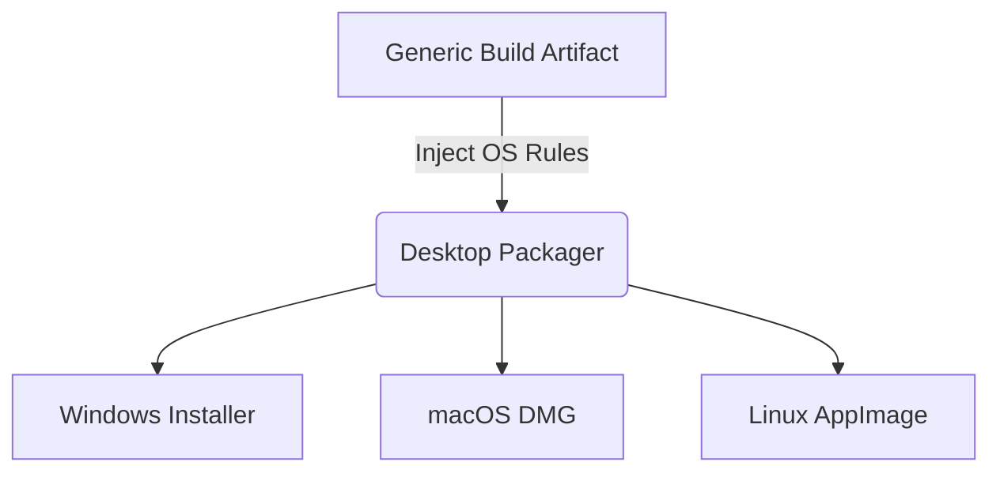

# 02 — Packaging Strategy

> **Module:** Build, Packaging & Release
> **Status:** Frozen
> **Version:** 1.0
> **Architecture Review:** Approved
> **Applies To:** Notebook Application

---

## 1. Purpose

The Packaging Strategy document governs how the generic build artifacts are bundled into distributable formats suitable for end-users across different operating systems.

---

## 2. Scope

Covers desktop packaging, resource bundling, plugin packaging logic, and ensuring offline capability upon installation.

---

## 3. Conceptual Strategy

### 3.1 Desktop Packaging
- The application is packaged as a standalone desktop executable (e.g., `.exe`, `.dmg`, `.AppImage`).
- The packaging toolchain must wrap the core logic, UI layer, and local SQLite engine into a single unified distribution.

### 3.2 Platform Independence
- While the core logic is cross-platform, packaging must respect OS-specific paradigms (e.g., placing data in `%APPDATA%` on Windows, or `~/Library/Application Support/` on macOS).

### 3.3 Resource Packaging
- All essential resources (local AI prompt templates, default CSS themes, bundled default plugins) must be embedded directly inside the package.

### 3.4 Plugin Packaging
- The system must define a standard packaging format for third-party plugins (e.g., a `.zip` or `.nbplugin` archive containing a manifest and logic).

### 3.5 Offline Distribution
- Packages must be fully self-contained. The user must be able to download the installer on a USB drive, move it to an air-gapped machine, and install a fully functional application.

---

## 4. Responsibilities

- **Release Engineering:** Configure and maintain the packaging toolchains for Windows, macOS, and Linux targets.

---

## 5. Business Rules

- **Self-Contained Executables:** The package cannot require the user to install external dependencies (e.g., Python, Node.js) manually to run the core application.

---

## 6. Workflow

---

## 7. Acceptance Criteria

- The resulting package can be installed and launched on a completely disconnected machine without crashing.

---

## 8. Future Enhancements

- Delivering differential packages (delta updates) to reduce download sizes for future updates.

---

## 9. Cross References

- [05-InstallerStrategy.md](./05-InstallerStrategy.md)
