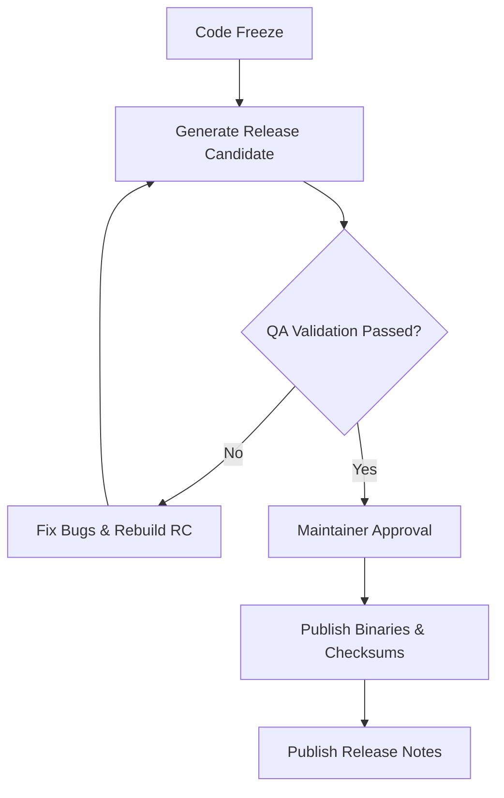

# 03 — Release Process

> **Module:** Build, Packaging & Release
> **Status:** Frozen
> **Version:** 1.0
> **Architecture Review:** Approved
> **Applies To:** Notebook Application

---

## 1. Purpose

The Release Process document outlines the lifecycle of taking a packaged release candidate and officially delivering it to the end user.

---

## 2. Scope

Covers planning, validation, approval, publishing, and communication of a new software release.

---

## 3. Conceptual Strategy

### 3.1 Release Readiness Philosophy
The software release process involves distinct stages of readiness:
- **Build Complete:** The code compiles and artifacts are generated.
- **Test Complete:** All automated tests (Unit, Integration, E2E) have passed.
- **Release Candidate:** A stable build intended for exploratory testing and validation.
- **Release Ready:** The Release Candidate has passed all Quality Gates and is awaiting approval.
- **Released Version:** The approved build has been packaged and distributed.

### 3.2 Release Planning
- Releases are planned based on milestones or semantic versioning goals.
- A "Release Branch" or "Release Tag" is created to freeze code for the upcoming version, allowing only critical bug fixes.

### 3.2 Validation & Approval
- The Release Candidate (RC) must pass the full suite of automated and manual QA checks defined in Phase 6.
- Final approval must be granted by designated project maintainers (Release Governance).

### 3.3 Publishing
- Approved packages are uploaded to the official distribution channels (e.g., GitHub Releases, official website).
- Signatures and checksums (e.g., SHA256) are generated and published alongside the binaries to verify integrity.

### 3.4 Documentation & Communication
- Release notes, changelogs, and updated user manuals are published simultaneously with the binaries.
- Users are notified of the new release via in-app notifications (if connected) or project communication channels.

---

## 4. Responsibilities

- **Release Manager:** Orchestrates the release timeline and gathers approvals.
- **QA Team:** Provides the final "Go/No-Go" based on test results.

---

## 5. Business Rules

- **Immutable Releases:** Once a version (e.g., v1.2.0) is published, its binaries and tags cannot be altered or overwritten. If a critical bug is found immediately, a new version (e.g., v1.2.1) must be released.

---

## 6. Workflow

---

## 7. Acceptance Criteria

- The release process is fully documented and auditable, showing exactly who approved the release and what commits were included.

---

## 8. Future Enhancements

- Automated rollback triggers if telemetry (if the user opts-in) detects massive crash spikes post-release.

---

## 9. Cross References

- [10-ReleaseGovernance.md](./10-ReleaseGovernance.md)
