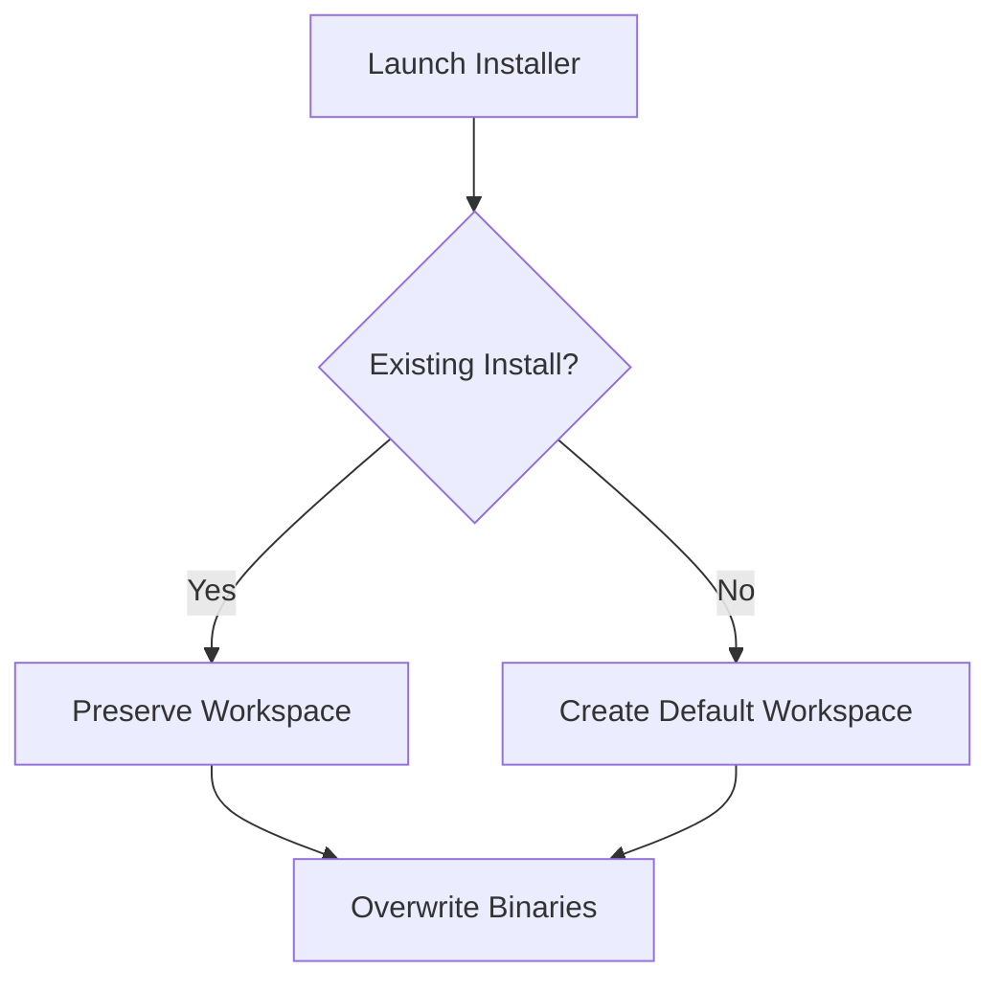

# 05 — Installer Strategy

> **Module:** Build, Packaging & Release
> **Status:** Frozen
> **Version:** 1.0
> **Architecture Review:** Approved
> **Applies To:** Notebook Application

---

## 1. Purpose

The Installer Strategy outlines the conceptual logic for how the application is installed on a host operating system, handling varying scenarios like fresh installs, upgrades, and portable executions.

---

## 2. Scope

Covers fresh installation, upgrade installation, portable installation, recovery, and validation.

---

## 3. Conceptual Strategy

### 3.1 Fresh Installation
- The installer places the executable binaries in the OS-appropriate program directory.
- It initializes the user's default workspace in the OS-appropriate AppData or Documents folder.

### 3.2 Upgrade Installation
- The installer must safely overwrite the program binaries without touching the user's workspace data.
- The first launch post-upgrade triggers the database schema migration logic.

### 3.3 Portable Installation
- A portable mode must be supported (e.g., a `.zip` archive) where the application stores its database and configuration directly adjacent to the executable, allowing it to run entirely from a USB drive.

### 3.4 Recovery & Validation
- The installer should provide a "Repair" option that verifies the integrity of the application binaries (using checksums) and restores any missing core assets.

---

## 4. Responsibilities

- **Release Engineering:** Author and maintain the installer scripts (e.g., NSIS, InnoSetup, or DMG generation).

---

## 5. Business Rules

- **Silent Workspace Preservation:** The uninstaller must *never* delete the user's workspace or database by default. It may offer a clear, explicit checkbox to "Remove User Data", which must default to unchecked.

---

## 6. Workflow

---

## 7. Acceptance Criteria

- Running an installer over an existing installation successfully upgrades the application without losing a single Note.

---

## 8. Future Enhancements

- Integration with OS-level package managers (e.g., Homebrew, Winget, APT).

---

## 9. Cross References

- [02-PackagingStrategy.md](./02-PackagingStrategy.md)
