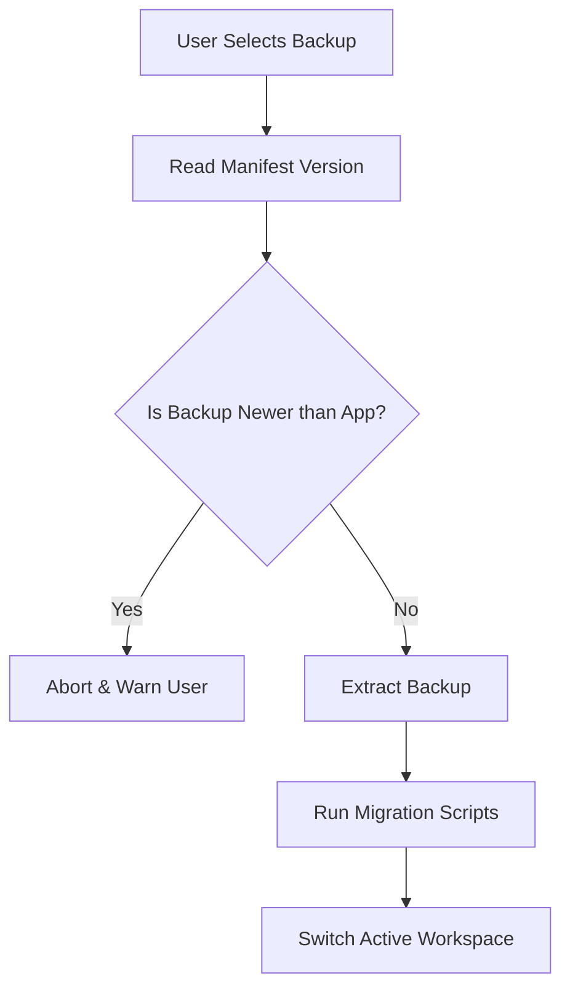

# 07 — Backup Compatibility

> **Module:** Build, Packaging & Release
> **Status:** Frozen
> **Version:** 1.0
> **Architecture Review:** Approved
> **Applies To:** Notebook Application

---

## 1. Purpose

The Backup Compatibility document ensures that data exported or backed up in older versions of the application remains accessible and restorable in newer versions.

---

## 2. Scope

Covers backup migration, restore validation, version compatibility, and cross-version support.

---

## 3. Conceptual Strategy

### 3.1 Compatibility & Recovery Philosophy
The conceptual relationship between version changes and data safety is defined as:
`Compatibility` → `Migration` → `Rollback` → `Recovery`

- **Recovery** protects user data.
- **Rollback** restores application stability.
- **Migration** preserves compatibility where applicable.

### 3.2 Version Compatibility
- Every generated backup artifact (e.g., a `.zip` containing the SQLite database and attachments) must include a clear `version` manifest indicating the application version that created it.

### 3.2 Backup Migration
- When a user attempts to restore a backup created by an older version, the application must detect the version discrepancy.
- It must then apply the standard database migration scripts to the restored SQLite file before making the workspace active.

### 3.3 Restore Validation
- The restore process must validate the integrity of the backup artifact (e.g., checking for corruption) before attempting migration.

### 3.4 Cross-Version Support
- Forward compatibility (restoring a v2 backup into a v1 application) is explicitly *not* supported. The application must detect this and gracefully inform the user to update their app.

---

## 4. Responsibilities

- **Backup & Restore Module Owners:** Implement the version checking and migration logic within the restore workflow.

---

## 5. Business Rules

- **Non-Destructive Restores:** A failed migration during a restore operation must abort the process and delete the temporary restored files, leaving the user's current workspace completely untouched.

---

## 6. Workflow

---

## 7. Acceptance Criteria

- A v1.0 backup can be successfully restored into a v2.0 application, with all data migrated cleanly.

---

## 8. Future Enhancements

- Tools to downgrade workspaces by exporting generic Markdown and re-importing, sidestepping database schema incompatibilities.

---

## 9. Cross References

- [03-modules/backup/README.md](../03-modules/backup/README.md)
