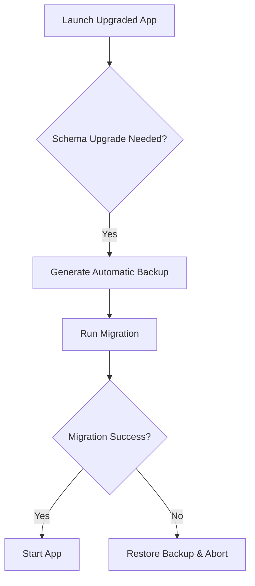

# 09 — Rollback Strategy

> **Module:** Build, Packaging & Release
> **Status:** Frozen
> **Version:** 1.0
> **Architecture Review:** Approved
> **Applies To:** Notebook Application

---

## 1. Purpose

The Rollback Strategy outlines how the system handles catastrophic failures during updates or releases, ensuring user data is protected and the application can return to a working state.

---

## 2. Scope

Covers rollback philosophy, failure recovery during installation, version recovery, and data protection.

---

## 3. Conceptual Strategy

### 3.1 Rollback Philosophy
- The safest rollback is one that never has to touch the user's data. If an application upgrade fails, restoring the previous binary should immediately restore application function.

### 3.2 Failure Recovery (Mid-Install)
- If the installer fails mid-execution (e.g., due to a locked file), it must attempt to revert all binary changes made during that session, leaving the previous version intact.

### 3.3 Version Recovery (Post-Install)
- If a user successfully installs an update, but the application crashes consistently on launch due to a bad release, the user can download the older version installer and run it.
- **Crucial Limitation:** If the newer version successfully migrated the database to a new schema before crashing, the older binary will *not* be able to read it. Thus, forcing the user to rely on the automatic workspace backup created prior to the migration.

### 3.4 Data Protection
- Before any database migration occurs, the application must automatically generate a full backup of the workspace in its current schema state.

---

## 4. Responsibilities

- **Core Engineering:** Implement the automatic pre-migration backup logic.

---

## 5. Business Rules

- **No Forward Compatibility:** The system does not attempt to write complex downgrade scripts for SQLite. It relies on full workspace backups for version recovery.

---

## 6. Workflow

---

## 7. Acceptance Criteria

- A simulated failed migration results in the workspace being seamlessly restored from the pre-migration backup without user intervention.

---

## 8. Future Enhancements

- "Safe Mode" boot options to bypass corrupted plugins or settings without requiring a full reinstall.

---

## 9. Cross References

- [06-UpdateStrategy.md](./06-UpdateStrategy.md)
