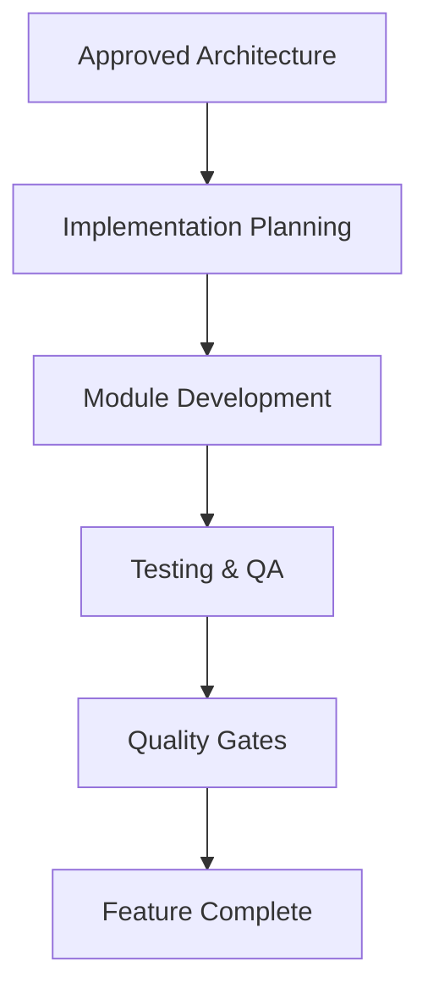

# 01 — Implementation Strategy

> **Module:** Implementation Planning & Roadmap
> **Status:** Draft
> **Applies To:** Notebook Application

---

## 1. Purpose

The Implementation Strategy outlines the overarching philosophy guiding the software's construction. It ensures the process remains orderly, robust, and aligned with the offline-first, local-first core identity.

---

## 2. Implementation Philosophy

### 2.1 Stable Foundations First
- Complex features (like AI or Sync) must not be built until the absolute core (Database, Workspace, Notes) is stable, heavily tested, and completely reliable.

### 2.2 Incremental Implementation
- Development should proceed in manageable, testable increments rather than attempting a "big bang" release. Features should be introduced modularly.

### 2.3 Vertical Slices
- Where appropriate, teams should implement complete "vertical slices" of a feature (from UI down to the local SQLite database) to quickly validate the end-to-end architecture before scaling out horizontally across all modules.

### 2.4 Feature Completeness
- A module is only considered implemented when it satisfies its specification, passes its tests, and includes required documentation. Implementation teams should avoid leaving "stubbed" core logic.

### 2.5 Backward Compatibility
- Once the schema hits v1.0, any incremental implementation in subsequent phases must preserve data integrity. Migration scripts must be developed alongside the feature that necessitates them.

---

## 3. Business Rules

- **Architecture Drives Implementation:** Code is written to fulfill the architecture, never the reverse. Implementation never redesigns architecture silently.

---

## 4. Workflow

---

## 5. Acceptance Criteria

- All development teams understand and adhere to the "Foundations First" and "Architecture Drives Implementation" maxims.

---

## 6. Cross References

- [02-DevelopmentPhases.md](./02-DevelopmentPhases.md)
