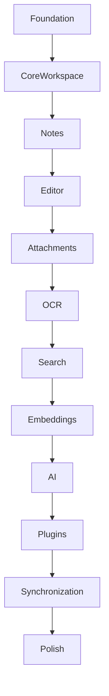

# 02 — Development Phases

> **Module:** Implementation Planning & Roadmap
> **Status:** Frozen
> **Version:** 1.0
> **Architecture Review:** Approved
> **Applies To:** Notebook Application

---

## 1. Purpose

The Development Phases document outlines the logical, sequential stages of implementation required to build the Notebook application from scratch to production readiness.

---

## 2. Logical Stages

The development follows a strict dependency order:

1. **Foundation:** Setup repository, local SQLite database schemas, dependency injection, logging, and error handling structures.
2. **Core Workspace:** Implementation of the Workspace selection, creation, and local storage context.
3. **Notes:** The core logic for creating, editing, and deleting text-based Notes.
4. **Editor:** The rich text / markdown rendering UI component.
5. **Attachments:** Support for local media, files, and asset storage associated with Notes.
6. **OCR:** Optical Character Recognition integration for images.
7. **Search:** Full-Text Search (FTS) across Notes and OCR text.
8. **Embeddings:** Generation of vector embeddings for all text content locally.
9. **AI:** Implementation of RAG (Context Assembly), prompt orchestration, and Conversation UI.
10. **Plugins:** The Plugin SDK sandbox and extension points.
11. **Synchronization:** Conflict resolution and background syncing of local data.
12. **Import / Export:** Logic for moving data in and out of the application safely.
13. **Backup:** Scheduled and manual Workspace backups.
14. **Notifications:** System alerts, sync errors, and background task updates.
15. **Settings:** User preferences, themes, and configuration UI.
16. **Polish:** Performance tuning, security fuzzing, UX refinements, and final E2E testing.

---

## 3. Workflow

---

## 4. Business Rules

- **No Skipping:** A phase cannot be considered complete until its immediate predecessors are fully functioning and passing tests.

---

## 5. Acceptance Criteria

- The implementation roadmap clearly articulates which parts of the application must be built first to satisfy dependencies.

---

## 6. Cross References

- [03-ModuleImplementationOrder.md](./03-ModuleImplementationOrder.md)
