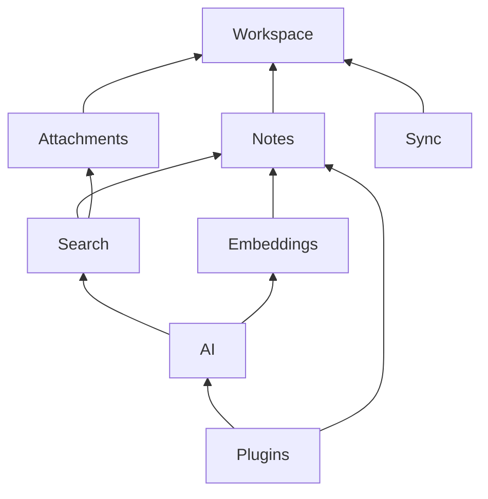

# 04 — Dependency Graph

> **Module:** Implementation Planning & Roadmap
> **Status:** Frozen
> **Version:** 1.0
> **Architecture Review:** Approved
> **Applies To:** Notebook Application

---

## 1. Purpose

The Dependency Graph document visualizes the conceptual boundaries and mandatory links between modules to ensure circular dependencies are avoided during implementation.

---

## 2. Conceptual Dependencies

### 2.1 Mandatory Dependencies
- **Strict Hierarchy:** Higher-level features must depend on lower-level domains, never the reverse.
- For example, the `Search` module *must* know about `Notes` (to index them). The `Notes` module *must not* know about `Search`. If a Note is saved, it publishes a generic event, which `Search` listens to.

### 2.2 Optional Dependencies
- **Graceful Degradation:** Some modules depend on others optionally. For example, `AI` optionally depends on `Embeddings`. If local embedding models fail to load, the AI can still generate responses (albeit without semantic RAG), preserving functionality.

### 2.3 Future Extension Points
- Modules like the `Plugin SDK` depend on the core APIs, providing extension points. Core domains remain strictly ignorant of any installed plugins.

---

## 3. Business Rules

- **No Circular Dependencies:** A circular dependency between two domains indicates a flaw in the implementation mapping and must be refactored before merging.

---

## 4. Workflow

*(Note: Arrows point from the dependent module to its required dependency)*

---

## 5. Acceptance Criteria

- Code review enforces the dependency rules; pull requests introducing circular references are blocked.

---

## 6. Cross References

- [03-ModuleImplementationOrder.md](./03-ModuleImplementationOrder.md)
