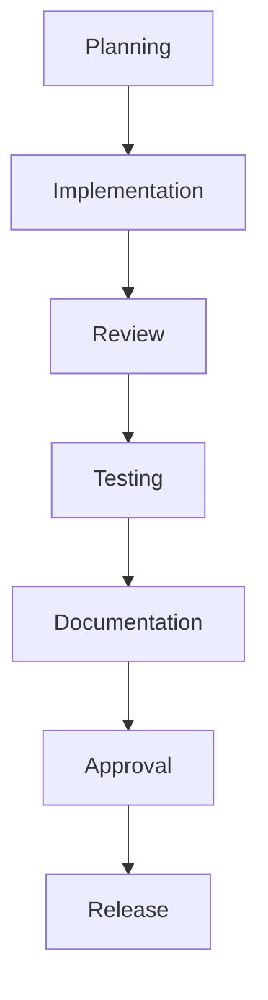

# 08 — Development Workflow

> **Module:** Implementation Planning & Roadmap
> **Status:** Draft
> **Applies To:** Notebook Application

---

## 1. Purpose

The Development Workflow document establishes the conceptual, step-by-step lifecycle for taking a feature from an architectural specification through implementation and into a released product.

---

## 2. Conceptual Workflow Stages

### 2.1 Planning
- Engineers review the approved architecture and module specifications.
- Dependencies are identified based on the Dependency Graph.

### 2.2 Implementation
- Code is written adhering strictly to the `docs/05-development-standards/`.
- Unit tests are written concurrently with the business logic.

### 2.3 Review
- Pull Requests are opened.
- Code Review assesses architectural alignment, security boundaries, and coding standards.

### 2.4 Testing
- CI executes automated Unit and Integration tests.
- QA performs manual exploratory testing on complex UI interactions.

### 2.5 Documentation
- Code changes requiring public API or architectural updates mandate simultaneous updates to the `docs/` folder.

### 2.6 Approval
- The feature branch is approved by Module Owners and merged into the main development branch.

### 2.7 Release
- The merged feature is packaged into a Release Candidate, validated against deployment criteria, and published.

---

## 3. Visual Workflow

---

## 4. Business Rules

- **No Shortcuts:** A feature cannot jump from Implementation directly to Release. It must pass through Review, Testing, Documentation, and Approval.

---

## 5. Acceptance Criteria

- The engineering team follows this workflow consistently, ensuring no unreviewed or untested code enters the main branch.

---

## 6. Cross References

- [06-testing-quality/12-TestGovernance.md](../06-testing-quality/12-TestGovernance.md)
