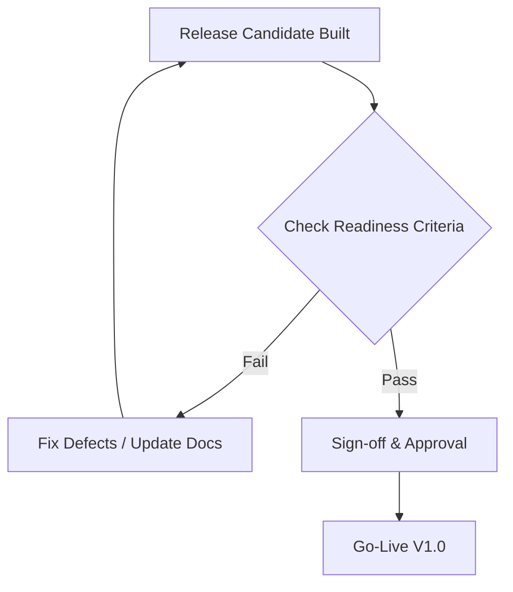

# 10 — Go-Live Readiness

> **Module:** Implementation Planning & Roadmap
> **Status:** Draft
> **Applies To:** Notebook Application

---

## 1. Purpose

The Go-Live Readiness document defines the absolute, non-negotiable criteria that must be met before the application transitions from Beta/Release Candidate to a formal public Version 1.0 release.

---

## 2. Readiness Criteria

### 2.1 Architecture
- **Architecture Frozen:** No major structural changes or outstanding ADRs remain unresolved.

### 2.2 Documentation
- **Documentation Complete:** The `docs/` repository accurately reflects the final implementation. User manuals and developer API guides (for the Plugin SDK) are published.

### 2.3 Testing
- **Testing Complete:** All Quality Gates have passed. No known Critical or High severity defects exist in the backlog.

### 2.4 Performance
- **Performance Acceptable:** The application meets defined thresholds (e.g., startup time < 2s, stable typing latency in 10,000-line notes).

### 2.5 Security
- **Security Reviewed:** The Plugin sandbox and AI privacy boundaries have been audited.

### 2.6 Release Management
- **Release Approved:** Formal sign-off obtained from the Project Lead and QA Team.
- **Rollback Available:** A clear, documented path exists for users to revert to a previous version if v1.0 catastrophically fails.
- **Backup Verified:** Automatic workspace backups are confirmed to trigger correctly prior to database migrations.

---

## 3. Business Rules

- **Strict Adherence:** A Go-Live event cannot occur if any of these criteria are unmet. If a High severity bug remains, the release must be delayed.

---

## 4. Workflow

---

## 5. Acceptance Criteria

- A formal "Go-Live Readiness Review" meeting is held prior to launch, explicitly addressing every item on this list.

---

## 6. Cross References

- [07-build-release/03-ReleaseProcess.md](../07-build-release/03-ReleaseProcess.md)
