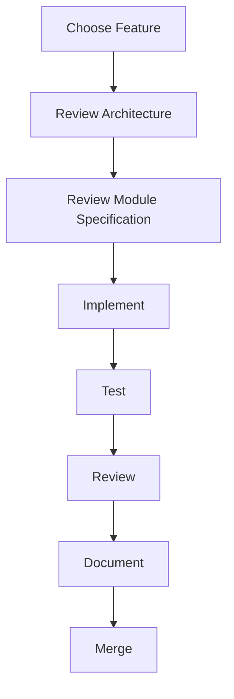

# 04 — Implementation Workflow

> **Module:** Implementation Playbook
> **Status:** Frozen
> **Version:** 1.0
> **Architecture Review:** Approved
> **Applies To:** Notebook Application

---

## 1. Purpose

The Implementation Workflow defines the step-by-step lifecycle a developer must follow when taking a feature from the backlog to a merged Pull Request.

---

## 2. The Workflow Steps

### Step 1: Choose Feature
- The Developer selects a prioritized feature from the backlog that aligns with the current Development Phase.

### Step 2: Review Architecture
- The Developer reads the overarching architectural guidelines to ensure the proposed feature aligns with the offline-first, local-first philosophy.

### Step 3: Review Module Specification
- The Developer reads the specific module documentation (e.g., `03-modules/search/`) to understand the exact business rules, dependencies, and boundaries required for this feature.

### Step 4: Implement
- The Developer writes the code, adhering strictly to the `docs/05-development-standards/`.

### Step 5: Test
- The Developer writes unit and integration tests.
- The Developer verifies the feature locally using synthetic test data.

### Step 6: Review
- A Peer Reviewer acts as a Quality Gate, verifying code quality, architectural alignment, and test coverage.

### Step 7: Document
- If the feature alters system behavior, the Developer updates the relevant documentation in the `docs/` folder.

### Step 8: Merge
- Upon approval and passing CI checks, the code is merged into the main branch by the maintainer.

---

## 3. Workflow Diagram

---

## 4. Responsibilities

- **Developer:** Owns Steps 1 through 7.
- **Reviewer:** Owns Step 6 and acts as the gatekeeper.
- **Maintainer:** Owns Step 8.

---

## 5. Business Rules

- **No Undocumented Features:** Step 7 is mandatory for any feature that introduces new UI, alters database schema, or changes public APIs.

---

## 6. Acceptance Criteria

- Developers follow this pipeline without attempting to merge undocumented or untested code.

---

## 7. Cross References

- [05-FeatureImplementationGuide.md](./05-FeatureImplementationGuide.md)
