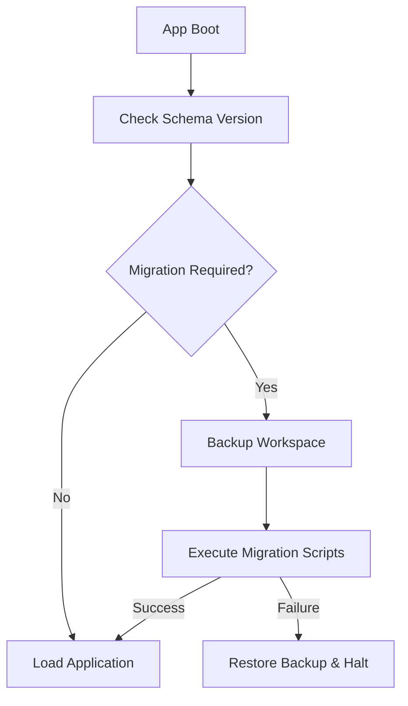

# 06 — Database Migration Strategy

> **Module:** Implementation Playbook
> **Status:** Frozen
> **Version:** 1.0
> **Architecture Review:** Approved
> **Applies To:** Notebook Application

---

## 1. Purpose

The Database Migration Strategy defines the implementation rules for altering the canonical SQLite schema without risking user data loss.

---

## 2. Conceptual Strategy

### 2.1 Migration Philosophy
- Database schema changes are strictly additive where possible.
- If a destructive change is required (e.g., merging two tables), the data must be transformed safely during the migration process.

### 2.2 Backward Compatibility
- Migrations must be written such that an application running v2.0 can perfectly read and migrate a database last used by v1.0.

### 2.3 Rollback Philosophy
- Due to the nature of local SQLite databases, complex schema downgrades (rolling back from v2.0 to v1.0) are not supported.
- Instead, the application must automatically backup the entire SQLite file *before* executing the migration script. If migration fails, the file is restored.

### 2.4 Validation
- Migration scripts must be heavily tested in CI against synthetic databases representing all previous major versions of the application.

### 2.5 Version Compatibility
- The database schema version is stored directly inside the SQLite database (e.g., `PRAGMA user_version`). The application checks this version on boot before allowing the `core` logic to load.

---

## 3. Responsibilities

- **Backend / Core Logic Team:** Owns the authoring and testing of all database migration scripts.

---

## 4. Business Rules

- **Pre-Migration Backups:** The application must never attempt a schema migration without first securing a local backup of the user's workspace.

---

## 5. Workflow

---

## 6. Acceptance Criteria

- A PR introducing a schema change is rejected if it does not include the corresponding migration script and migration unit tests.

---

## 7. Cross References

- [02-database/01-SchemaDesign.md](../02-database/01-SchemaDesign.md)
