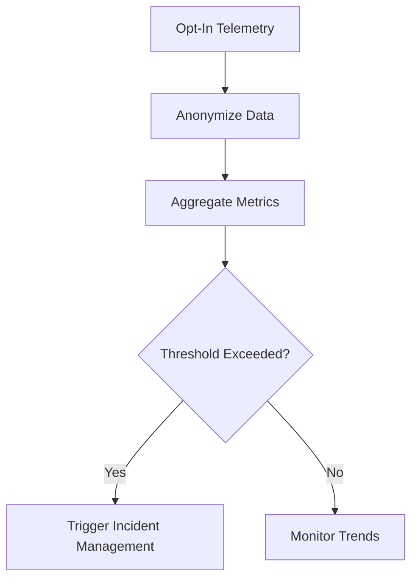

# 03 — Monitoring Strategy

> **Module:** Operations, Maintenance & Evolution
> **Status:** Frozen
> **Version:** 1.0
> **Architecture Review:** Approved
> **Applies To:** Notebook Application

---

## 1. Purpose

The Monitoring Strategy outlines how the health and performance of the application are observed conceptually over time, enabling maintainers to identify systemic issues without violating user privacy.

---

## 2. Conceptual Monitoring Areas

### 2.1 Application Health & Error Trends
- Monitoring aggregated, anonymized crash reports to identify spikes in fatal errors post-release.
- Tracking which specific modules (e.g., the SQLite Engine vs. the UI renderer) are throwing the most exceptions.

### 2.2 Performance Trends
- Observing startup times and memory consumption metrics across different operating systems.
- Identifying slow rendering frames in massive documents.

### 2.3 Plugin Health
- Tracking crash rates for specific third-party plugins to identify unstable extensions in the ecosystem.

### 2.4 Synchronization & Backup Health
- Monitoring the success/failure rate of background sync operations and scheduled backups to ensure data safety mechanisms are functioning.

### 2.5 AI Subsystem Health
- Tracking the latency of prompt generation and local inference to identify model performance degradation across hardware configurations.

---

## 3. Business Rules

- **Strict Anonymity:** Any telemetry or crash reporting must be strictly opt-in. It must never transmit file names, note contents, search queries, or user settings.

---

## 4. Workflow

---

## 5. Acceptance Criteria

- Maintainers can view aggregated performance trends without ever having access to individual user data.

---

## 6. Cross References

- [04-IncidentManagement.md](./04-IncidentManagement.md)
