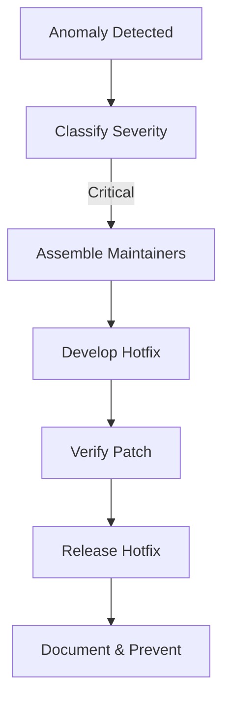

# 04 — Incident Management

> **Module:** Operations, Maintenance & Evolution
> **Status:** Frozen
> **Version:** 1.0
> **Architecture Review:** Approved
> **Applies To:** Notebook Application

---

## 1. Purpose

The Incident Management process dictates how the core maintainer team responds to critical bugs, data corruption reports, or security vulnerabilities post-release.

---

## 2. Incident Lifecycle

### 2.1 Detection
- Anomalies are detected via community issue trackers, automated crash reports (opt-in), or security disclosures.

### 2.2 Classification
- **Critical:** Widespread data corruption, security breaches, or application failing to boot.
- **High:** Core feature (e.g., Sync, Search) entirely broken, but data is safe.
- **Medium:** UI glitches, non-critical plugin crashes.

### 2.3 Investigation
- Maintainers isolate the issue using synthetic testing environments.
- Due to the privacy-first model, maintainers must rely on reproducible steps rather than acquiring the user's actual database.

### 2.4 Recovery
- A patch or Hotfix is developed to restore application stability.
- If data was corrupted, a migration/recovery script must be included in the patch to salvage user data.

### 2.5 Verification
- The Hotfix undergoes expedited, but mandatory, QA testing.

### 2.6 Documentation & Future Prevention
- The incident is documented. If an architectural flaw caused the issue, an ADR is written to alter the architecture, and new automated tests are added to the CI pipeline to prevent regression.

---

## 3. Workflow

---

## 4. Business Rules

- **Data Safety First:** During a Critical incident involving data corruption, the immediate action should be instructing users to pause syncing and back up their workspaces.

---

## 5. Acceptance Criteria

- The project maintains a public incident log or security advisory page for transparency.

---

## 6. Cross References

- [03-MonitoringStrategy.md](./03-MonitoringStrategy.md)
