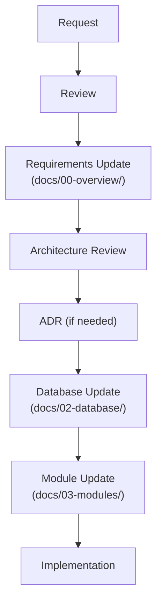

# Documentation Governance

> **Document Type:** Governance
> **Status:** Active
> **Applies To:** Notebook Project

---

## 1. Purpose

This document defines the documentation governance rules for the Notebook project. Its purpose is to ensure that the architecture, requirements, and design remain consistent throughout the lifetime of the project. This document defines how project documentation **shall** evolve through controlled, reviewable changes.

---

## 2. Source of Truth

The following documentation hierarchy **shall** be considered authoritative. When conflicts occur, higher-priority documents take precedence over lower-priority ones.

1. **ADR (Architecture Decision Records)** — The ultimate authority on specific design choices
2. **Architecture Documents** — System overview and subsystem design
3. **Database Documents** — Data models and schemas
4. **Module Specifications** — Internal module design
5. **Development Guides** — Implementation practices

---

## 3. Architecture Freeze

Once the Architecture documentation is approved, it is considered **frozen**.

- Architecture documents **shall not** be rewritten.
- Major architectural changes require a new Architecture Decision Record (ADR).
- Existing architecture documents may only be updated (patched) to reflect an approved ADR.

---

## 4. ADR Rules

Every significant architectural decision **shall** be documented as an Architecture Decision Record (ADR).

**Examples of decisions requiring an ADR:**
- Database strategy (e.g., SQLite per Workspace)
- Storage model
- Synchronization model
- Plugin system architecture
- AI provider abstraction
- Workspace model changes
- Security model adjustments

**Each ADR shall include:**
- **Status** (Draft, Accepted, Rejected, Superseded)
- **Context** (The problem or situation)
- **Decision** (What is being done)
- **Alternatives Considered** (What else was evaluated and why it was rejected)
- **Consequences** (Impact on the system)
- **Trade-offs** (Accepted downsides or risks)

---

## 5. Documentation Update Rules

The following rules apply to all documentation updates:

- **Do not regenerate documents.** Complete regeneration destroys history and introduces subtle inconsistencies.
- **Do not rewrite approved documents.** Apply targeted patches whenever possible.
- **Maintain existing terminology and numbering.** Do not renumber sections or change terms unless explicitly directed by an ADR.
- **Cross-reference documents** instead of duplicating content. Use relative links.

---

## 6. Feature Requests

New feature requests **shall** follow this process:

---

## 7. Consistency Rules

Maintain consistent terminology across all documentation and code.

| Term | Authorized Meaning |
|---|---|
| **Workspace** | The top-level logical container for user data. The primary unit of isolation. |
| **Google Drive** | An optional synchronization provider, not the primary data store. |
| **SQLite** | The primary data store. |

**Avoid introducing conflicting terminology.** Use the established terms exclusively.

---

## 8. AI Documentation Rules

AI coding agents generating or updating documentation **shall**:

1. **Read existing documentation first** to understand the context and constraints.
2. **Avoid rewriting approved documents.** Make surgical edits via multi-replace or patch tools.
3. **Avoid introducing new technologies without approval.** No unexpected databases, frameworks, or cloud services.
4. **Preserve architectural consistency** across all files.
5. **Follow approved ADRs.** Ensure edits do not violate recorded decisions.
6. **Generate incremental updates** whenever possible rather than creating entirely new parallel documents.

---

## 9. Change Policy

| Change Type | Requirement |
|---|---|
| **Minor corrections** (typos, clarifications) | Allowed without ADR. |
| **Architectural changes** | Require an approved ADR before modifying other documents. |
| **Breaking changes** | Require an approved ADR and synchronized updates to all affected documents. |

---

## 10. Guiding Principle

The Notebook project values:

- **Simplicity** over complex abstractions
- **Maintainability** over cleverness
- **Consistency** in design and terminology
- **Offline-first** as a non-negotiable requirement
- **Local-first** for all data ownership
- **Privacy-first** by design (no telemetry, no unexpected network calls)
- **Workspace-first** as the organizing paradigm
- **Incremental evolution** over large rewrites

The documentation **shall** evolve through controlled, reviewable changes rather than complete regeneration.
