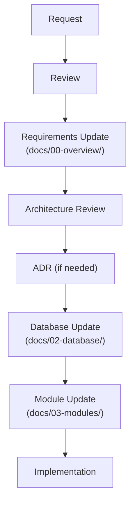

# Documentation Governance

> **Document Type:** Governance
> **Status:** Active
> **Applies To:** Notebook Project

---

## 1. Purpose

This document defines the documentation governance rules for the Notebook project. Its purpose is to ensure that the architecture, requirements, and design remain consistent throughout the lifetime of the project. This document defines how project documentation **shall** evolve through controlled, reviewable changes.

---

## 2. Source of Truth

The following documentation hierarchy **shall** be considered authoritative. When conflicts occur, higher-priority documents take precedence over lower-priority ones.

1. **Governance Documents**
2. **Architecture Decision Records (ADR)**
3. **Product Requirements (docs/00-overview)**
4. **Architecture Documents**
5. **Database Documents**
6. **Module Specifications**
7. **Development Guides**

- Governance defines the documentation process.
- ADRs are the authoritative record for approved architectural decisions.
- Product Requirements define WHAT the application must do.
- Architecture defines HOW the application is designed.
- Database documentation defines how information is stored.
- Module documentation defines feature behavior.
- Development guides define implementation practices.

---

## 3. Architecture Freeze

Once the Architecture documentation is approved, it is considered **frozen**.

- Architecture documents **shall not** be rewritten.
- Major architectural changes require a new Architecture Decision Record (ADR).
- Existing architecture documents may only be updated (patched) to reflect an approved ADR.

---

## Product Requirements Freeze

- Once the Product Requirements documentation (`docs/00-overview`) has been approved, it is considered frozen.
- Approved requirements **shall not** be rewritten.
- New requirements **shall** be introduced through incremental updates.
- Requirement changes that affect architecture **shall** require an ADR before implementation.
- Existing requirements may only be modified when correcting mistakes or reflecting an approved architectural decision.

---

## 4. ADR Rules

Every significant architectural decision **shall** be documented as an Architecture Decision Record (ADR).

**Examples of decisions requiring an ADR:**
- Database strategy (e.g., SQLite per Workspace)
- Storage model
- Synchronization model
- Plugin system architecture
- AI provider abstraction
- Workspace model changes
- Security model adjustments

**Each ADR shall include:**
- **Status** (Draft, Accepted, Rejected, Superseded)
- **Context** (The problem or situation)
- **Decision** (What is being done)
- **Alternatives Considered** (What else was evaluated and why it was rejected)
- **Consequences** (Impact on the system)
- **Trade-offs** (Accepted downsides or risks)

---

## 5. Documentation Update Rules

The following rules apply to all documentation updates:

- **Do not regenerate documents.** Complete regeneration destroys history and introduces subtle inconsistencies.
- **Do not rewrite approved documents.** Apply targeted patches whenever possible.
- **Maintain existing terminology and numbering.** Do not renumber sections or change terms unless explicitly directed by an ADR.
- **Cross-reference documents** instead of duplicating content. Use relative links.

---

## 6. Feature Requests

New feature requests **shall** follow this process:



---

## 7. Consistency Rules

Maintain consistent terminology across all documentation and code.

| Term | Authorized Meaning |
|---|---|
| **Workspace** | The top-level logical container for user data. The primary unit of isolation. |
| **Google Drive** | An optional synchronization provider, not the primary data store. |
| **SQLite** | The primary data store. |

**Avoid introducing conflicting terminology.** Use the established terms exclusively.

---

## 8. AI Documentation Rules

AI coding agents generating or updating documentation **shall**:

1. **Read existing documentation first** to understand the context and constraints.
2. **Avoid rewriting approved documents.** Make surgical edits via multi-replace or patch tools.
3. **Avoid introducing new technologies without approval.** No unexpected databases, frameworks, or cloud services.
4. **Preserve architectural consistency** across all files.
5. **Follow approved ADRs.** Ensure edits do not violate recorded decisions.
6. **Generate incremental updates** whenever possible rather than creating entirely new parallel documents.
7. Before closing any implementation task, review all affected documentation and synchronize it with the implementation. An implementation is not complete until documentation has been updated and `PROJECT_PROGRESS.md` and `CHANGELOG.md` have been synchronized.

---

## 9. Change Policy

| Change Type | Requirement |
|---|---|
| **Minor corrections** (typos, clarifications) | Allowed without ADR. |
| **Architectural changes** | Require an approved ADR before modifying other documents. |
| **Breaking changes** | Require an approved ADR and synchronized updates to all affected documents. |

---

## Implementation Rule

- Implementation is not the source of truth.
- Documentation defines expected behavior.
- If implementation differs from documentation, the discrepancy **shall** be reviewed.
- Documentation **shall** only be updated after the design decision has been approved.
- Code **shall** follow approved documentation rather than redefine it.

---

## Dependency Rule

- Dependencies **shall** always point inward.
- Domain **shall never** depend on Infrastructure.
- Domain **shall never** depend on UI.
- Application may depend on Domain.
- Infrastructure may depend on Domain interfaces.
- UI communicates with the Application layer only.
- Plugins communicate only through published extension interfaces.
- Direct cross-layer dependencies are prohibited unless explicitly documented.

---

## Documentation Versioning

- Documentation evolves incrementally.
- Large rewrites should be avoided.
- Approved documents should receive targeted patches.
- Architectural evolution **shall** be tracked using ADRs.
- Documentation history should remain understandable over time.

---

## 10. Guiding Principle

The Notebook project values:

- **Simplicity** over complex abstractions
- **Maintainability** over cleverness
- **Consistency** in design and terminology
- **Offline-first** as a non-negotiable requirement
- **Local-first** for all data ownership
- **Privacy-first** by design (no telemetry, no unexpected network calls)
- **Workspace-first** as the organizing paradigm
- **Incremental evolution** over large rewrites

The documentation **shall** evolve through controlled, reviewable changes rather than complete regeneration.

---

## 11. Documentation Governance Enhancements

### 11.1 Document Authority Matrix

Each major topic has a single authoritative source. Consulting any other document for the same topic is informational only. When in conflict, the authoritative source takes precedence.

| Topic | Authoritative Source |
|---|---|
| **Vision & Product Requirements** | `docs/00-overview/` |
| **System Architecture** | `docs/01-architecture/` |
| **Database Design** | `docs/02-database/` |
| **Module Specifications** | `docs/03-modules/` |
| **AI & RAG Design** | `docs/04-ai-rag/` |
| **Development Standards** | `docs/05-development-standards/` |
| **Testing & Quality** | `docs/06-testing-quality/` |
| **Build, Packaging & Release** | `docs/07-build-release/` |
| **Implementation Planning** | `docs/08-implementation-planning/` |
| **Implementation Guidance** | `docs/09-implementation-playbook/` |
| **Operations & Maintenance** | `docs/10-operations-maintenance/` |
| **Architectural Decisions** | `docs/ADR/` |
| **Governance Rules** | `docs/GOVERNANCE.md` |
| **Project Status** | `docs/PROJECT_PROGRESS.md` |
| **Documentation Index** | `docs/INDEX.md` |

Each topic has a single authoritative source to avoid documentation drift.

---

### 11.2 Document Update Matrix

When a significant change occurs, the following documentation areas must be reviewed for consistency. This matrix describes relationships only.

| Change Type | Areas to Review |
|---|---|
| **New module added** | `03-modules/`, `02-database/`, `01-architecture/`, `08-implementation-planning/`, `INDEX.md`, `PROJECT_PROGRESS.md` |
| **Database schema change** | `02-database/`, `03-modules/` (affected), `09-implementation-playbook/06-DatabaseMigrationStrategy.md`, `ADR/` |
| **AI architecture change** | `04-ai-rag/`, `03-modules/` (AI module), `09-implementation-playbook/07-AIImplementationGuidelines.md`, `ADR/` |
| **Plugin SDK change** | `03-modules/plugins/`, `09-implementation-playbook/08-PluginImplementationGuidelines.md`, `10-operations-maintenance/07-PluginLifecycleManagement.md`, `ADR/` |
| **Synchronization change** | `03-modules/sync/`, `09-implementation-playbook/09-SynchronizationImplementationGuidelines.md`, `02-database/`, `ADR/` |
| **Backup strategy change** | `03-modules/backup/`, `10-operations-maintenance/05-BackupOperations.md`, `07-build-release/07-BackupCompatibility.md`, `ADR/` |
| **Security policy change** | `05-development-standards/10-SecurityGuidelines.md`, `10-operations-maintenance/09-SecurityMaintenance.md`, `03-modules/plugins/`, `ADR/` |
| **Release process change** | `07-build-release/`, `10-operations-maintenance/`, `ADR/` |

---

### 11.3 Version Governance

The project distinguishes four independent versioning concepts:

| Version Type | Meaning | Owner |
|---|---|---|
| **Documentation Version** | The version of the written specification documents (e.g., `v1.0`). Frozen documents are immutable until an ADR authorizes an update. | Architects |
| **Architecture Version** | The conceptual design of the system (tracked via ADRs). Architecture versions evolve only through approved ADRs. | Architects |
| **Application Version** | The version of the released software binary (e.g., `1.0.0`, `2.1.3`). Follows Semantic Versioning. | Release Governance |
| **Module Version** | The version of an individual module specification. A module may be at `v1.0` while the application is at `v0.8`. | Module Owners |

These lifecycles are independent. An application `v2.0` release does not automatically require a Documentation `v2.0` update unless architectural decisions changed.

---

### 11.4 Requirement Traceability

Every implementation decision should remain traceable to an approved requirement. The conceptual traceability chain is:

```
Vision
  ↓
Requirements (docs/00-overview/)
  ↓
Architecture (docs/01-architecture/)
  ↓
Module Specifications (docs/03-modules/)
  ↓
Implementation (guided by docs/09-implementation-playbook/)
  ↓
Testing (docs/06-testing-quality/)
  ↓
Release (docs/07-build-release/)
  ↓
Operations (docs/10-operations-maintenance/)
```

If an implementation decision cannot be traced back to an approved requirement or module specification, it should be treated as undocumented behavior and must either be documented via an ADR or removed.

---

### 11.5 Documentation Consistency Checklist

When performing any future documentation update, the following items should be verified before closing the update:

- [ ] **Cross-references validated:** All hyperlinks within updated documents point to correct, existing targets.
- [ ] **ADRs reviewed:** If the update reflects an architectural decision, a corresponding ADR exists or is being authored.
- [ ] **Ownership boundaries preserved:** No module now claims responsibilities that belong to another module.
- [ ] **Terminology consistency verified:** All terms used match the authorized terminology in Section 7 of this document.
- [ ] **Version information synchronized:** Status metadata (`Status`, `Version`, `Architecture Review`) is consistent across the updated documents.
- [ ] **INDEX.md updated:** If a new document or directory was added, `docs/INDEX.md` reflects it.
- [ ] **PROJECT_PROGRESS.md updated:** The project tracker reflects the current completion state.

---

### 11.6 Optional Implementation-Support Phases

Future phases that support the implementation process (such as Tooling & Environment Setup) are classified as **implementation-support phases**. These are distinct from the core architecture documentation (Phases 0–10).

---

## 11.7 Implementation Completion & Documentation Synchronization

Implementation is not considered complete until the implementation, documentation, and project tracking have been synchronized.

### Definition of Done

Every implementation task shall finish with the following activities before it is considered complete:

1. Review all documentation affected by the implementation.
2. Update every affected document using targeted patches.
3. Update `PROJECT_PROGRESS.md`.
4. Update `CHANGELOG.md`.
5. Verify that repository structure documentation reflects the current implementation.
6. Verify that documentation remains consistent with the implementation.
7. Remove or update obsolete documentation created by implementation changes.
8. Verify that no approved document contradicts the current implementation.

Implementation shall not be considered complete if any affected documentation remains outdated.

---

### Mandatory Documentation Review

Every implementation shall review, at minimum, the following documents where applicable:

- `PROJECT_PROGRESS.md`
- `CHANGELOG.md`
- `INDEX.md`
- Architecture documents
- Module specifications
- Database documentation
- AI documentation
- Plugin documentation
- Development standards
- Build documentation
- Testing documentation
- Operations documentation
- README.md (if applicable)

Only documents affected by the implementation shall be modified.

---

### Implementation Report

Every completed implementation shall provide a final implementation report containing:

- Summary of work completed
- Files created
- Files modified
- Packages installed
- Dependencies updated
- Documentation updated
- Validation performed
- Remaining work
- Known limitations

This report becomes part of the implementation history and shall be used to update `PROJECT_PROGRESS.md` and `CHANGELOG.md`.

---

### Documentation Synchronization Rule

Code shall never become the only source of truth.

If implementation introduces new behavior, configuration, packages, workflows, folders, IPC channels, APIs, database objects, or build processes, the corresponding documentation shall be updated before the implementation is considered complete.

Documentation synchronization is a mandatory completion criterion rather than an optional follow-up task.

**Classification:**
- They do not form part of the frozen architectural blueprint.
- They do not modify any architectural decision, module specification, or governance rule.
- They exist solely to accelerate practical implementation and may evolve freely as tooling and environments change.
- They are not subject to the same ADR-controlled freeze process as architectural documents.
